# **Plan-It Go Travel Planner**

<br>

## **CONTENTS**

* [User Experience (UX)](#user-experience-ux)
    * [Strategy](#strategy)
        * [Project Goals](#project-goals)
        * [Target Users](#target-users)
    * [Agile Methodology](#agile-methodology)
        * [Epics](#epics)
        * [User Stories](#user-stories)
    * [Skeleton Plane](#skeleton-plane)
        * [Wireframes](#wireframes)
        * [Database Schema](#database-schema)
    * [Structure Plane](#structure-plane)
        * [Features](#features)
            * [Navbar](#navbar)
            * [Footer](#footer)
            * [Home Page](#home-page)
                * [Header Hero Image](#header-hero-image)
                * [Site Goals](#site-goals)
                * [Destination Carousel](#destinations-carousel)
            * [Browse Places](#browse-places)
            * [Browse Details](#browse-details)
            * [Authorisation](#authorisation)
                * [Sign Up](#sign-up)
                * [Login](#login)
                * [Logout](#logout)
            * [Trip List](#trip-list)
                * [New Users](#new-users)
                * [Returning Users](#returning-users)
            * [Profile Creation](#profile-creation)
            * [Trip Creation](#trip-creation)
            * [Trip Details](#trip-details)
                * [Trip Summary](#trip-summary)
                * [Recommendations](#recommendations)
                * [Trip Itinerary](#trip-itinerary)
            * [Place Details](#place-details)
                * [Place Summary](#place-summary)
                * [Details Tab](#details-tab)
                * [Reviews Tab](#reviews-tab)
                * [Gallery Tab](#gallery-tab)
            * [User Reviews](#user-reviews)
            * [User Images](#user-images)
            * [Toasts](#toasts)
            * [Role Based Login](#role-based-login)
                * [Staff User Functionality](#staff-user-functionality)
                * [Django Admin Panel](#django-admin-panel)
            * [Error Pages](#error-pages)
                * [404 Error Page](#404-error-page)
                * [403 Error Page](#403-error-page)
                * [500 Error Page](#500-error-page)
            * [Favicon and Meta Tags](#favicon-and-meta-tags)
            * [Security](#security)
                * [Defensive Programming](#defensive-programnming)
                * [CRSF Tokens](#crsf-tokens)
            * [Responsive Design](#responsive-design)
* [Technologies Used](#technologies-used)
    * [Languages Used](#languages-used)
    * [Programs and Tools Used](#programs-and-tools-used)
    * [Frameworks and Libraries Used](#frameworks-and-libraries-used)
* [Testing](#testing)
* [Deployment and Local Development](#deployment-and-local-development)
* [Bugs](#bugs)
    * [Known Bugs](#known-bugs)
    * [Solved Bugs](#solved-bugs)
* [Credits](#credits)
    * [Code Used and Referenced](#code-used-and-referenced)
    * [Media](#media)
    * [Acknowledgements](#acknowledgements)


# **User Experience (UX)**

## **STRATEGY PLANE**
___

## **Project Goals**

<br>

The aim of Plan-It Go is to provide inspiration for new and exciting adventures and assist the user in planning their next trip.

Born out of a love for travel and exploring new cities, this site hopes to help the user plot out their ideal itinerary, by offering recommendations based on the experience of other travellers.  Arriving in a new city can be overwhelming if you don’t know where you’re heading.  If only you had known about a quirky little bar or restaurant round the corner rather than settling for second best. Sometimes the best kept secrets are not so obvious, but with the help of Plan-It Go, you can be in the know about the best places to visit.

Having selected a location for their trip, users will be provided with recommendations of places to visit.  Once logged in to the site, users will have the ability to use these recommendations to build an itinerary for their trip.
Recommendations will be sourced using the [Amadeus Points Of Interest API](https://developers.amadeus.com/self-service/category/destination-experiences/api-doc/points-of-interest).  This is a summary of the API functionality from their documentation:

*`
"The API provides a ranked list of attractions and the name, coordinates, category (sights, beach/park, historical, nightlife, restaurant or shopping), tags and score for each one. The scores are powered by the AVUXI TopPlace algorithm which analyses millions of online reviews, photos and comments to determine popularity"
`*

When users add a place to their trip itinerary, data retrieved from the API for this place will be added to the site’s own ‘place’ database.  As site traffic increases and users start building their own trips, reviewing places they have visited and posting photos of their experiences, the data collated from these interactions will be used to start making recommendations to other site users.

The ‘trip planner’ functionality also serves as a great way for users to record and journal their travels, storing their ‘go to’ places for the next time they return to a city and preserving memories with photos of the places they visited.

All users of the site will be able find inspiration for their next getaway, by browsing trips that other users have planned.  The site owner hopes that this will encourage users to create their own account and make use of the trip planner themselves.  The site serves as a stand alone travel planner, but the functionality could also be integrated into larger travel sites.


[Back to top &uarr;](#contents)

## **Target Users**

<br>

## **AGILE METHODOLOGY**
___

This project was approached following the principles of Agile Development, building the solution incrementally through repeated iterations.  Initially, 5 [epics](#Epics) were defined.  These were broad definitions of functionality for the site that would not fit into a single iteration.

Epics were then broken down into user stories and logged as issues on GitHub using the following [customised template](https://github.com/rkillickdev/plan-it-go/blob/main/.github/ISSUE_TEMPLATE/epic.md).  Acceptance Criteria were defined as part of each user story to clearly present the objectives and conditions that must be satisfied for the user story to be marked as complete.  Implementation of the user story was then broken down into tasks - technical work required to facilitate execution of the user story.  Each user story was given a story points label to indicate the estimated amount of work required to complete the story.

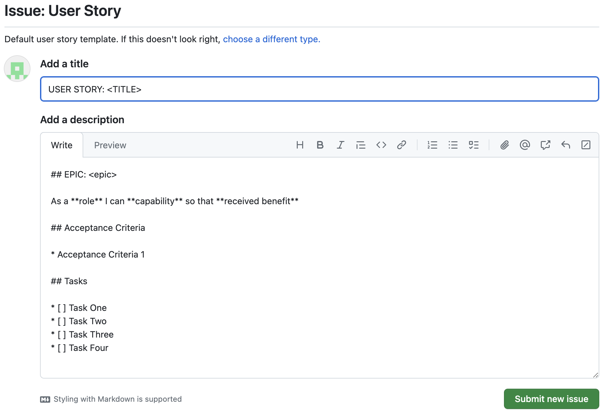

A Product Backlog milestone was created on GitHub to establish a 'single authoritative source of work'.  I initially moved all user stories to the backlog before they were allocated to sprints.  The product backlog was refined throughout the course of development with user stories reprioritised as the project evolved.

Timeboxing was used throughout the development of the project.  Week long 'sprints' (otherwise referred to as iterations) were defined using Milestones on Github.  User stories from the product backlog were then allocated to a sprint following the principles of moSCow prioritisation.  Each user story was assigned a label specifying "Must Have", "Could Have" or "Should Have" to indicate expecation of its completion.  Stories were then tackled according to level of priority.  When defining prioritisation levels for each user story in a sprint, I was mindful that the percentage of "Must Haves" should 'not exceed 60% of the overall effort planned for the iteration'.  A 20% contingency of "Could Haves" was set, therefore leaving the remaining 20% for "Should Haves".  If it was clear that a user story would not be completed in the current sprint, it was labelled as "Won't Have" and returned to the Product Backlog.  This was then allocated to a future sprint with a highter prioritisation level.

Throughout the development process, I used a kanban board to provide up to date information about the status of progress for each iteration.  The board was created and managed using GitHub Projects and can be viewed [here](https://github.com/users/rkillickdev/projects/4).

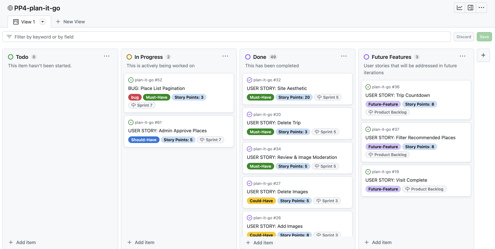

User stories for each sprint were initially allocated to the 'Todo' column and then transferred to the 'In Progress' column as they were worked on.  Once each task for the user story had been completed and all acceptance criteria satisfied, the issue was marked as complete and moved to the 'Done' column.

There are three user stories that have not been addressed in any of the iterations so far.  These are not core to the functionality of the site, but might be nice to have eventually so I have stored these in a 'Future Features' column.  They can then easily be prioritised and allocated to a future sprint.

### **Epics**

#### **EPIC: User Account [#1](https://github.com/rkillickdev/plan-it-go/issues/1)**
`
Create the functionality for site users to create and use their own Account/ Profile
`

#### **EPIC: Plan Trip [#7](https://github.com/rkillickdev/plan-it-go/issues/7)**
`
Provide functionality so the site user can create/ read/ update/ delete trips and build an itinerary of places to visit
`

#### **EPIC: Manage Trip [#16](https://github.com/rkillickdev/plan-it-go/issues/16)**
`
Provide functionality so the site user can view and update any trips that they have created
`

#### **EPIC: Review [#21](https://github.com/rkillickdev/plan-it-go/issues/21)**
`
Create functionality for the user to log their experiences of visiting a place from their planner itinerary, by writing reviews and uploading images
`

#### **EPIC: User Experience [#28](https://github.com/rkillickdev/plan-it-go/issues/28)**
`
Implement functionality and design within the site to ensure a positive user experience
`

### **User Stories**

#### **EPIC: User Account [#1](https://github.com/rkillickdev/plan-it-go/issues/1)**

* As a Site User I can register an account so that I can access features only available to registered users such as creating and planning trips [#2](https://github.com/rkillickdev/plan-it-go/issues/2)
* As a Site User I can log in to my account so that I can create, view, update and delete my trips [#3](https://github.com/rkillickdev/plan-it-go/issues/3)
* As a Site User I can log out of my account for security so that no one else can access or modify my trips [#4](https://github.com/rkillickdev/plan-it-go/issues/4)
* As a Site User I am aware of my login status so I know whether I can carry out actions available only to logged in users [#5](https://github.com/rkillickdev/plan-it-go/issues/5)
* As a Site User I can create and update a user profile for my account so that I can personalise my details with a screen name, image and bio [#6](https://github.com/rkillickdev/plan-it-go/issues/6)
* As a Site Administrator I can moderate user reviews so that I can decide whether the content and images are appropriate for other site users to view [#34](https://github.com/rkillickdev/plan-it-go/issues/34)
* As a Site Administrator I can access models from the Django admin panel so that I can interact directly with the database [#35](https://github.com/rkillickdev/plan-it-go/issues/35)
* As a user with staff status I can add and amend details for destinations so that the content on the site can continually be expanded and updated [#39](https://github.com/rkillickdev/plan-it-go/issues/39)
* As a user with staff status I can add places for a destination to the database so that site users can browse these recommended places and add to their trips [#40](https://github.com/rkillickdev/plan-it-go/issues/40)
* As an admin superuser I can customise the django admin panel so that I can order and filter instances of models [#42](https://github.com/rkillickdev/plan-it-go/issues/42)
* As a staff user I can moderate places through the site interface so that I can ensure places with sufficient quality info are displayed to site users [#61](https://github.com/rkillickdev/plan-it-go/issues/61)

#### **EPIC: Plan Trip [#7](https://github.com/rkillickdev/plan-it-go/issues/7)**

* As a Site User I can create a personalised trip planner for a chosen destination so that I can start planning places to visit on my trip [#8](https://github.com/rkillickdev/plan-it-go/issues/8)
* As a Site User I can view recommended activities for the chosen location so that I can plan a bespoke itinerary for the trip that appeals to my tastes and interests [#9](https://github.com/rkillickdev/plan-it-go/issues/9)
* As a Site User I can view details of a specific place so that I can decide whether I should add it to my itinerary [#10](https://github.com/rkillickdev/plan-it-go/issues/10)
* As a Site User I can add a recommendation to my trip planner so that I can build an itinerary to use and refer to when travelling to the location [#11](https://github.com/rkillickdev/plan-it-go/issues/11)
* As a Site User I can remove places from my trip planner so that I can have control over building an itinerary and change my mind about places that were previously added [#12](https://github.com/rkillickdev/plan-it-go/issues/12)
* As a Site User I can choose to view my current trip itinerary at any point during planning so that I can keep track of places I have added [#13](https://github.com/rkillickdev/plan-it-go/issues/13)
* As a Site User I can edit my trip itinerary by removing a place or adding more so that I can continue modifying my plans [#14](https://github.com/rkillickdev/plan-it-go/issues/14)
* As a Site User I can save all the places in my trip itinerary so that I can return to my planning at any time [#15](https://github.com/rkillickdev/plan-it-go/issues/15)
* As a user I can see a countdown to my trip so that I know how many days until I travel [#36](https://github.com/rkillickdev/plan-it-go/issues/36)
* As a user I can filter recommended places so that I can build an itinerary tailored to my interests [#37](https://github.com/rkillickdev/plan-it-go/issues/37)
* As a user I can see places visually on a map so that I can see where they are and plan a route [#38](https://github.com/rkillickdev/plan-it-go/issues/38)
* As a user I can view place ratings displayed as stars so that I can immediately understand the popularity of a place [#41](https://github.com/rkillickdev/plan-it-go/issues/41)

#### **EPIC: Manage Trip [#16](https://github.com/rkillickdev/plan-it-go/issues/16)**

* As a Site User I can view a summary of all upcoming and completed trips so that I can choose one to view or edit [#17](https://github.com/rkillickdev/plan-it-go/issues/17)
* As a Site User I can select a trip so that I can view or edit details of the itinerary [#18](https://github.com/rkillickdev/plan-it-go/issues/18)
* As a Site User I can mark places on a trip itinerary as completed so that I can keep track of places that I have visited while travelling [#19](https://github.com/rkillickdev/plan-it-go/issues/19)
* As a Site User I can delete an entire trip so that I have control of the trips that are stored in my user account [#20](https://github.com/rkillickdev/plan-it-go/issues/20)

#### **EPIC: Review [#21](https://github.com/rkillickdev/plan-it-go/issues/21)**

* As a Site User I can write a review of a place on my itinerary so that I can share my experiences of the visit with other site users [#22](https://github.com/rkillickdev/plan-it-go/issues/22)
* As a Site User I can edit my review so that I can update the content or correct grammatical errors [#23](https://github.com/rkillickdev/plan-it-go/issues/23)
* As a Site User I can delete my review so that I can have control of reviews if I decide they are no longer relevant or necessary [#24](https://github.com/rkillickdev/plan-it-go/issues/24)
* As a Site User I can decide whether I would recommend a place so that I can help other site users to make decisions when planning places to visit on their trip [#25](https://github.com/rkillickdev/plan-it-go/issues/25)
* As a Site User I can upload images for a place on my itinerary so that I can store the memories from my trip and share these experiences with other site users [#26](https://github.com/rkillickdev/plan-it-go/issues/26)
* As a Site User I can delete images that I have uploaded for a place so that I can have control over which images are viewable [#27](https://github.com/rkillickdev/plan-it-go/issues/27)

#### **EPIC: User Experience [#28](https://github.com/rkillickdev/plan-it-go/issues/28)**

* As a Site User I can immediately understand the purpose of the site when I arrive at the home page so that I can quickly and intuitively start planning trips [#29](https://github.com/rkillickdev/plan-it-go/issues/29)
* As a Site User I can intuitively navigate the site so that I can view the content I require with minimal steps [#30](https://github.com/rkillickdev/plan-it-go/issues/30)
* As a Site User I can view site content simply and intuitively so that I can easily gather the information I need [#31](https://github.com/rkillickdev/plan-it-go/issues/31)
* As a Site User I **feel a positive emotional response while interacting with the site ** so I am engaged and continue to use and return [#32](https://github.com/rkillickdev/plan-it-go/issues/32)
* As a Site User I can view the site on a range of screen sizes so that I can enjoy good user experience on my device of choice [#33](https://github.com/rkillickdev/plan-it-go/issues/33)
* As a user I can access links to social media accounts related to the site so that I can find out more about the site and its developer [#46](https://github.com/rkillickdev/plan-it-go/issues/46)


## **SKELETON PLANE**
___

## **Wireframes**

<br>

## **Database Schema**

<br>

[A PDF for Database Schema v01 Can be viewd here](docs/database-schema/planit-go-database-highlight-schema-v01.pdf)

[The database schema created using dbdiagram.io can be found here](https://dbdiagram.io/d/64f2f6f902bd1c4a5ed78564)

### **Population of the Places Database**

A question that arose during the planning stages of the project was how best to provide a list of recommended places to visit based on a location selected by the site user.  I looked into various travel APIs that could deliver this data.

Initially, I planned to use the [Amadeus Points Of Interest API](https://developers.amadeus.com/self-service/category/destination-experiences/api-doc/points-of-interest).  This is a summary of the API functionality from their documentation:

*`
"The API provides a ranked list of attractions and the name, coordinates, category (sights, beach/park, historical, nightlife, restaurant or shopping), tags and score for each one. The scores are powered by the AVUXI TopPlace algorithm which analyses millions of online reviews, photos and comments to determine popularity"
`*

I tested this API and results were successful. I deliberated over whether this could be used in production to fetch data each time a site user created a new trip.  Ultimately, I decided that this API didn't provide all the information fields that a user might need, mostly notably an image and description.

On further investigation, I discovered the [APIFY Tripadvisor Scraper](https://apify.com/maxcopell/tripadvisor).  I initially wrote a view called get_places that used the API associated with this web scraping tool to return a data set and then populate the Places database with the results.  Code for this can be seen [here](docs/old-code/apify-webscraper-api-call.py)  Results were successful in the development environment although response time much slower than the Amadeus API.  However once the site was deployed to Heroku, results became less reliable where the api call and response appeared successful but Heroku threw an error before results could be written to the database.

Given the time limitations of the project, I have decided to prepopulate the Places database with places for a certain amount of pre-defined locations for demonstartion purposes. I can run a request from the APIFY dashboard for a specified location and save the response in a json file which is then stored in a [data folder with Static Files](static/data).  The [get_places view](places/views.py) has been modified to iterate over a specified json file and populate the database.  I have created a user login with staff permissions that is able to access and run this view via the site user interface.  You can read more about staff login functionality [here](#staff-login-functionality)


## **STRUCTURE PLANE**
___

## **Features**

### **Navbar**


The navbar is common to all pages.  The HTML structure for this feature lives in the nav.html file with the following file path:

```
templates/includes/nav.html
```
This file is then included in the base.html file, which is subsequently included in every html template.  This ensures that any changes to the navbar html code need only be made once.

To the left of the navbar is a clean, minimal brand logo that is deigned to instantly comumunicate the core aims of the site.  By using a globe as a substitute for the letter 'O' in 'GO', site users are subconciously aware that 'planning of global travel' is at the heart of the site's objectives.  The colours used in the brand logo are consistent with the colour scheme used throughout the rest of the site.  The hover effect applied to the brand logo is consistent with the effect used for all other clickable links throughout.  Clicking on the logo takes the site user back to the home page.

To the right of the navbar, page links are displayed and a hover effect applied so users know they are clickable.  Links for the currently active page are styled using the site's primary colour.  Dependent on the status of the site user, links display as shown in the table below.  This helps to signal to the user their current authentication status.

| Link | Template | Visibility |
| ---- | -------| -------- |
| Home | index.html | All users |
| Profile | profile_form.html | Logged in users |
| My Trips | trip_list.html | Logged in users |
| Signup | signup.html | Logged out users |
| Login | login.html | Logged out users |
| Logout | logout.html | Logged in users |

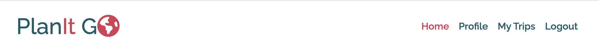

To ensure good user experience and satisfy the site owner's goal of responsive design across a range of device sizes, the navigation menu collapses down into a hamburger menu on screen sizes below 992px.  This prevents the navbar from feeling cluttered on smaller devices and the instantly recognisable hamburger icon ensures that site navigation remains intuitive for users.


Clicking on the hamburger icon expands the nav links which are stacked vertically.  Clicking again collapses the links.

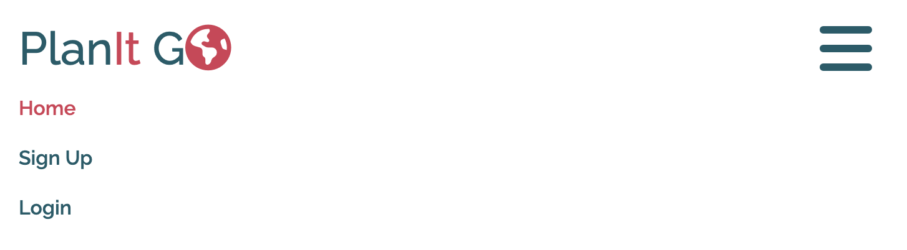


### **Footer**


The footer is common to all pages.  The HTML structure for this feature lives in the footer.html file with the following file path:

```
templates/includes/footer.html
```

The footer displays social media links to the PlanIt-Go Facebook, Twitter and Instagram pages.  These open in new browser tabs when clicked.  Font awesome icons are used as they are universally recognisable for the user without the need for text.  A hover effect which transforms the icon to the primary site colour indicates to the user that these links are clickable.  The GitHub profile name of the site developer is also displayed and a clickable GitHub icon that directs the user to the repository for PlanIt-Go in a new browser tab.

### **Home Page**

#### **Header Hero Image**


The aim of the owner is that the purpose of the site should be immediately evident to the user when they land on the home page.  The hero image chosen to convey this message communicate both the themes of travel and planning, with the coloured pins placed in the map reminiscent of an age before the possibility of online trip planning.  A younger site user is more likely to associate these pins with the recognisable Google Maps interface, where digital pins are used to comunicate location.

The colours from the hero image were the starting point for the colour scheme used consistently throughout the rest of the site, although for accessibility I had to use stronger shades to ensure acceptable contrast.  The core goals of the site are reinforced by the title in the header, and the revolving words add a touch of visual interest for the user.  The colours chosen for these interchanging words tie in with one of the featured pins shown on the map.

A call to action is then used, to draw the user into the 'trip planning' fuctionality of the site.  The 'Sign Up' clickable button will direct non logged in users to the signup page.  Those that already have user credentials can easily switch to the login page to enter their details.  If a user is already logged in, the call to action button displays 'Get Started' and redirects the user to their 'trip list' page where they can edit existing trips or create new ones.

#### **Site Goals**

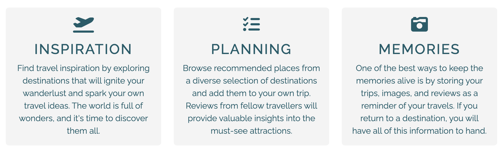

Three cards on the home page layout the ways in which the site can be used.  The inclusion of icons above each statement helps communicate these goals before the user has even read the text.

#### **Destinations Carousel**

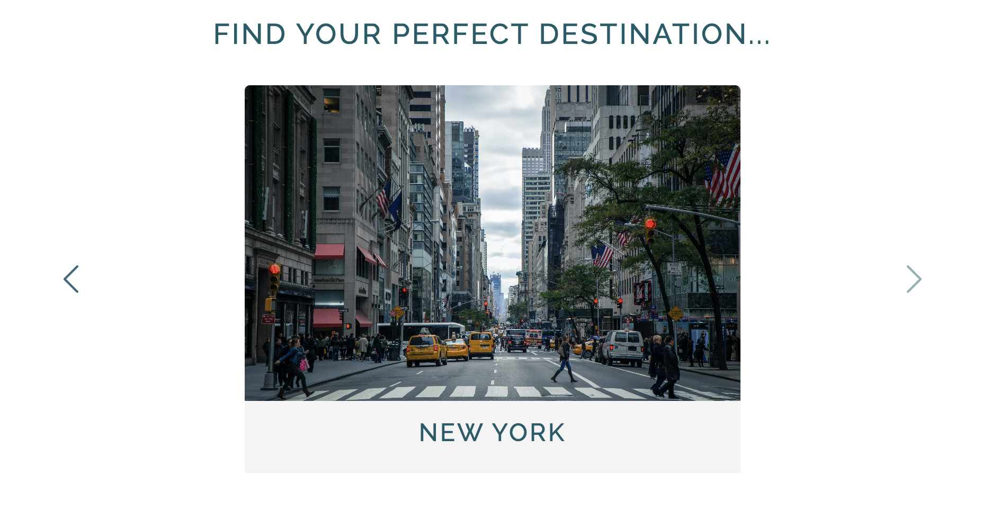

The aim of this section is to allow users to browse and draw inspiration.  Clicking on each carousel card display information about the featured destination in a large modal window.  From here, they can follow a 'Things To Do' link for this specific destination.  Throughout, the user will be gently guided and given the option to sign up and enjoy the full features and functionality of the site.

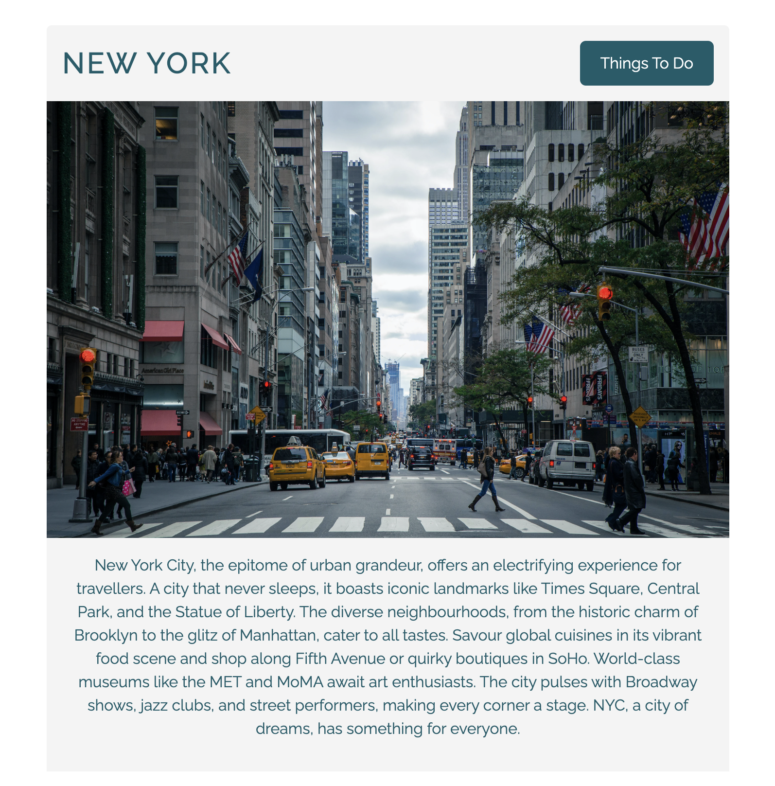

#### **Browse Places**

Users that are not logged in can still browse place recommendations for each featured destination.  Results are paginated to 12 places per page and displayed as clickable cards.  Users are always provided with the option to discover 'More Destinations'.  Clicking on this button directs them back to the home page destinations carousel.


#### **Browse Details**

Users that are not logged in can view details of a place.  The appearance and styling of this page replicates what a logged in user would see.  The main difference is that clicking on the 'Plan A Trip' button directs the user to the 'sign up' page.  Clicking on the 'More Places' button navigates back to the browse places page.

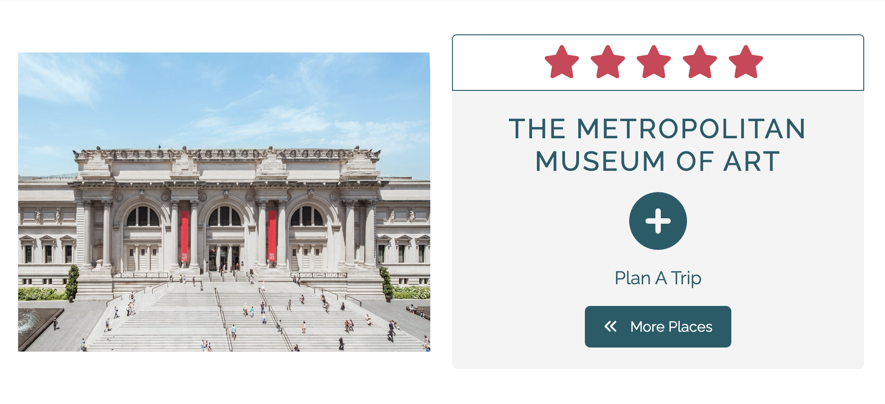

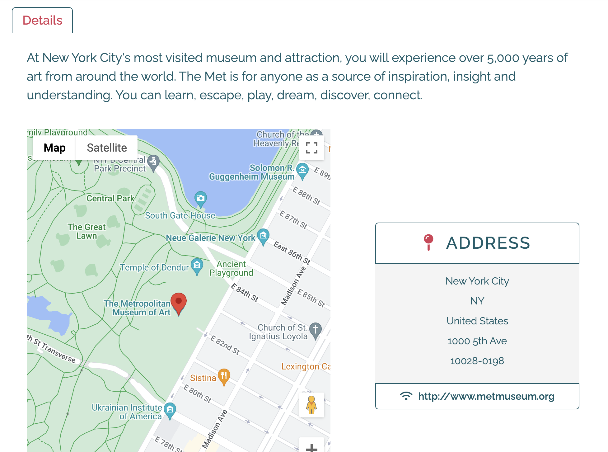

### **Authorisation**

The default Django allauth templates used for signing up, logging in and logging out have been styled to match the rest of the site and ensure a consistent user experience.

#### **Sign Up**

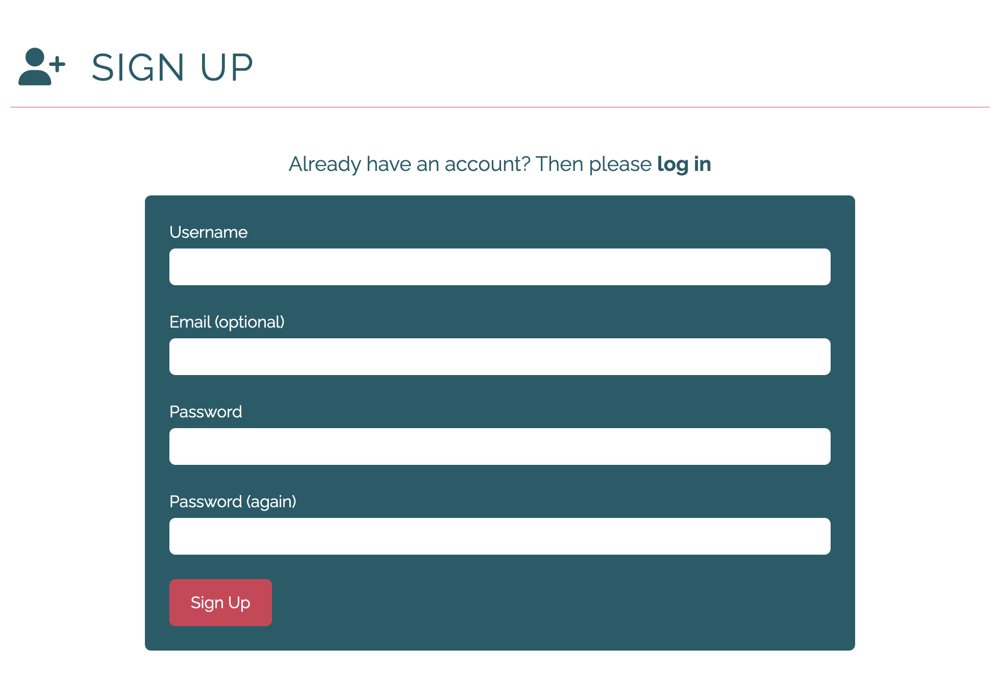

#### **Login**

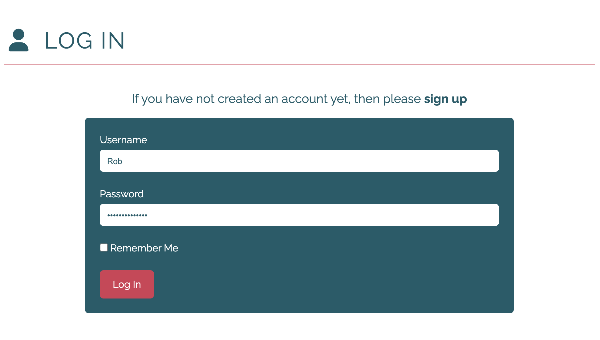

#### **Logout**


In the settings.py file, the following urls have been set for redirecting users after signup and login:

```python
ACCOUNT_SIGNUP_REDIRECT_URL = '/trips/trip_list'
LOGIN_REDIRECT_URL = '/trips/trip_list'
```

### **Trip List** 

Dependent on the status of the logged in user account, one of three pages are displayed.  Conditional 'If/ Else' statements are used in the html template to achieve these different displays:

#### **New Users**

Upon successful login, a user profile is automatically created with a unique id.  The aim of the site however is to offer personalised profiles, so new users are encouraged to click the 'Create Profile' link where they can enter a unique screen name, upload a profile image and write a bio.  Only the screen name is a compulsory field in the form, as this is how they will be identified on the site moving forwards.


#### **Returning Users**

If a logged in user has already provided a screen name, but as yet have not created any trips, they are encouraged to get started and click the + button 'Create A Trip'.  There is also the option to seek some inspiration, which lets the user browse trips planned by fellow site users.

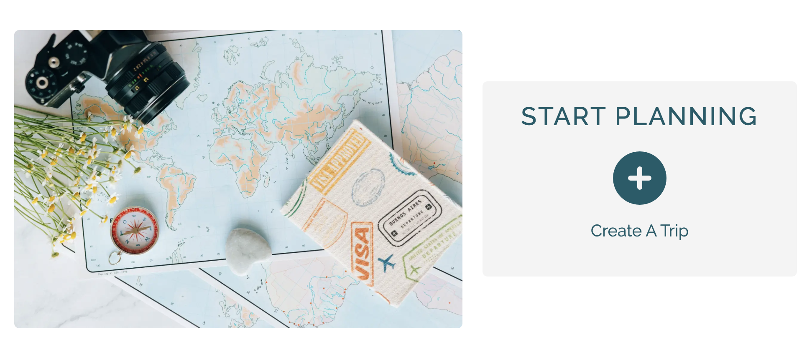
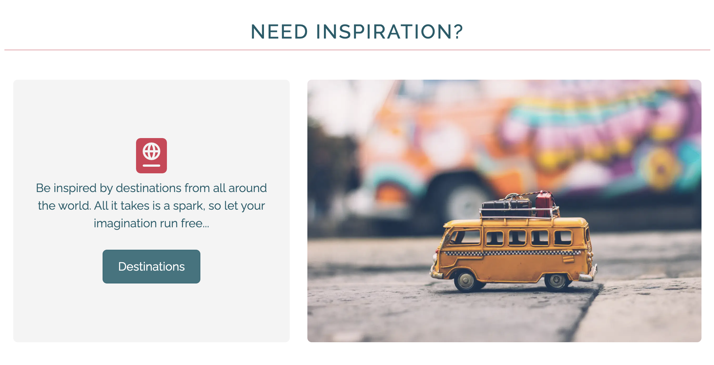

If a logged in user already has one or more trips created, these are listed in date created order.  They can either click on each trip to view further details, or click the + button 'Create A Trip'.

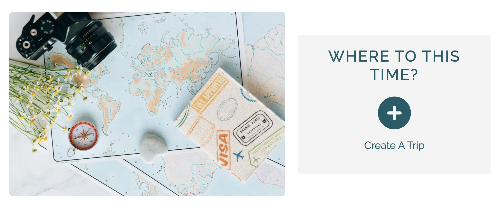
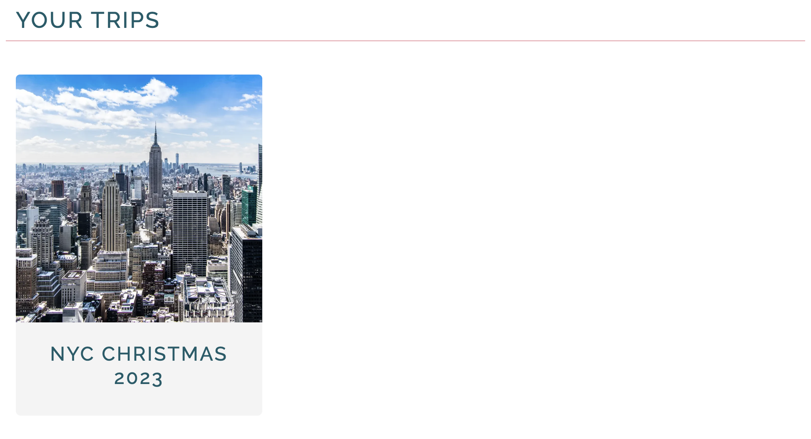

### **Profile Creation**

If the user has not already entered profile information, placeholders are used for the image and bio.  I f the user enters these fields, their own image and bio is then displayed on their profile page.


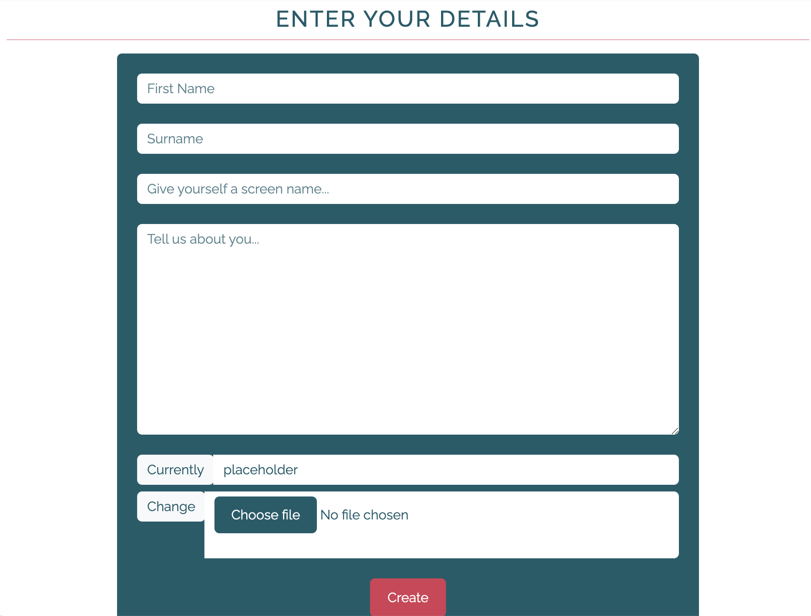

Once the user has entered required profile details, clicking on the profile link in the nav bar at any time displays their profile info which they can update if desired.


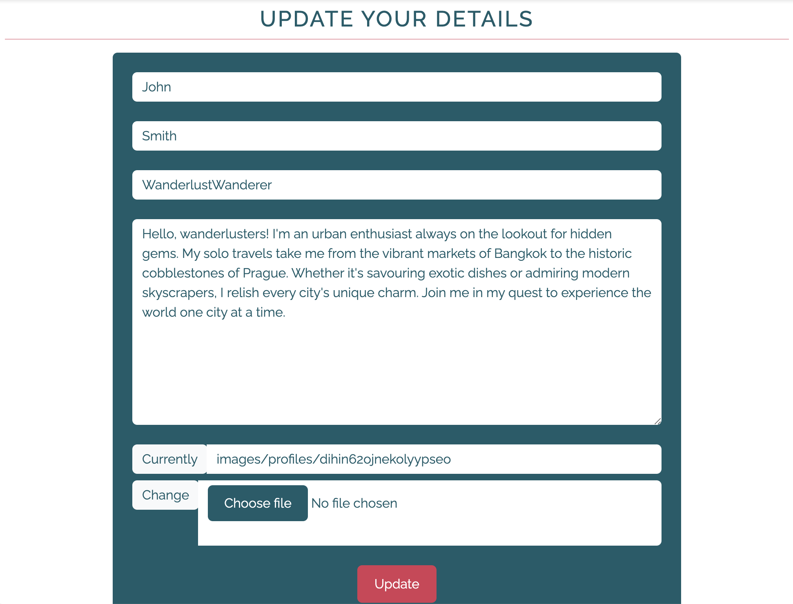

### **Trip Creation**

The form used to create a new trip has been generated using django-crispy-forms.  Styling to keep it consistent with the est of the site has been done in the forms.py file in the trips app.

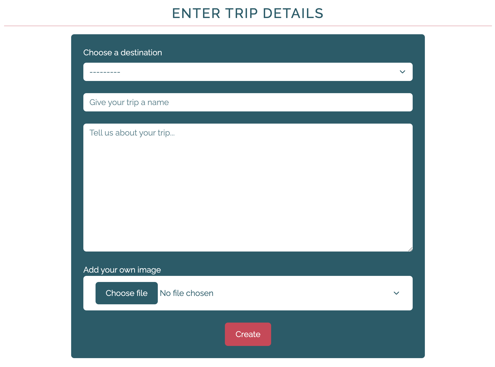

### **Trip Details**

#### **Trip Summary**

The bootstrap accordion component is used to store a map displaying the trip destination, trip title, trip title and clickable icons for users to instigate actions.  The accordion is displayed open by default but clicking the arrow icon collapses it.  As places are added to the trip itinerary, markers are added to pinpoint that place on the map.  If there are several places in a small radius, a cluster icon is displayed.  This functionality has been implemented using Google Maps [Marker Clustering](https://developers.google.com/maps/documentation/javascript/marker-clustering#cdn).

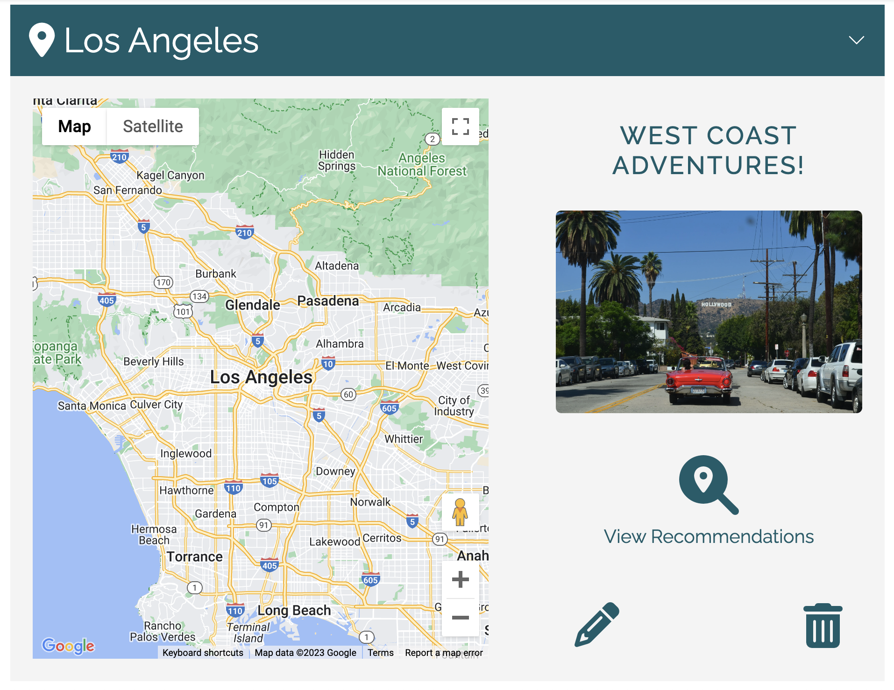

Clicking on view recommendations locates the user to the 'Recommendations' section on the same page.  Clicking on the pencil icon directs the user to the trip update form where they can edit details.  Clicking on the trash can icon displays a delete confirm modal.  If the user confirms deletion of the trip, they are redirected back to their trip list page.

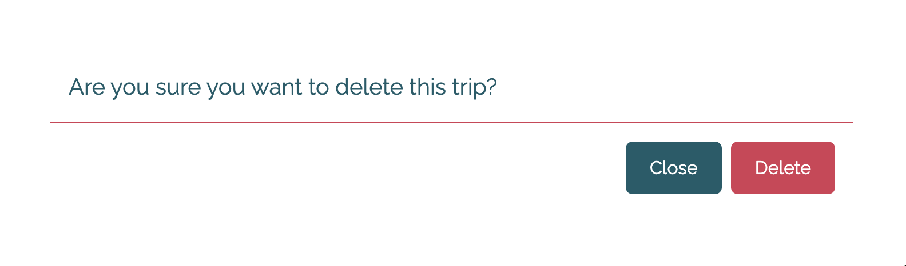

#### **Recommendations**

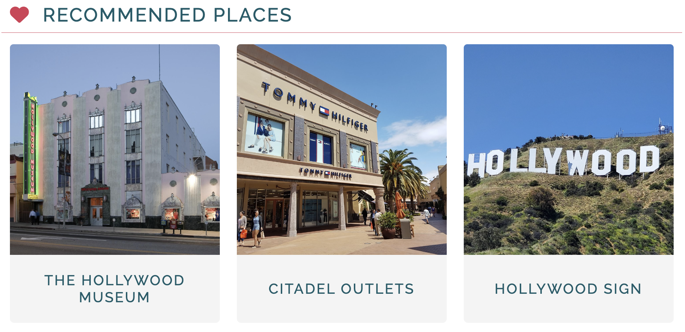

Users are presented with recommended places to add to their itinerary based on the trip destination.  The results returned from the Place model are paginated 12 places at a time with 3 places displayed per row. The card for each place has a hover effect applied to indicate to the user that this is a clickable link.  Clicking on a place directs the user to the relevant [Place Details Page](#place-details).  Places that have already been added to the trip itinerary do not appear as part of this list of recommendations.

#### **Trip Itinerary**

An accordion component is used to display information relating to the trip itinerary, but only appears on screen once the trip has at least one place added. By default, each place in the itinerary is collapsed:

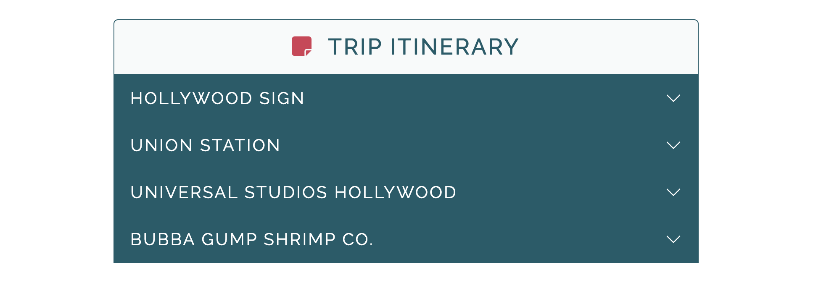

Expanding each accordion item presents the user with the followig clickable options:

* Image is clickable -> Directs user to the [Place Details Page](#place-details)
* Remove From Planner -> A modal is used to confirm the user's intention to delete the place.
* Leave A Review -> Directs user to the [User Reviews Page](#user-reviews) 
* Upload Image -> Directs user to the [User Images Page](#user-images)

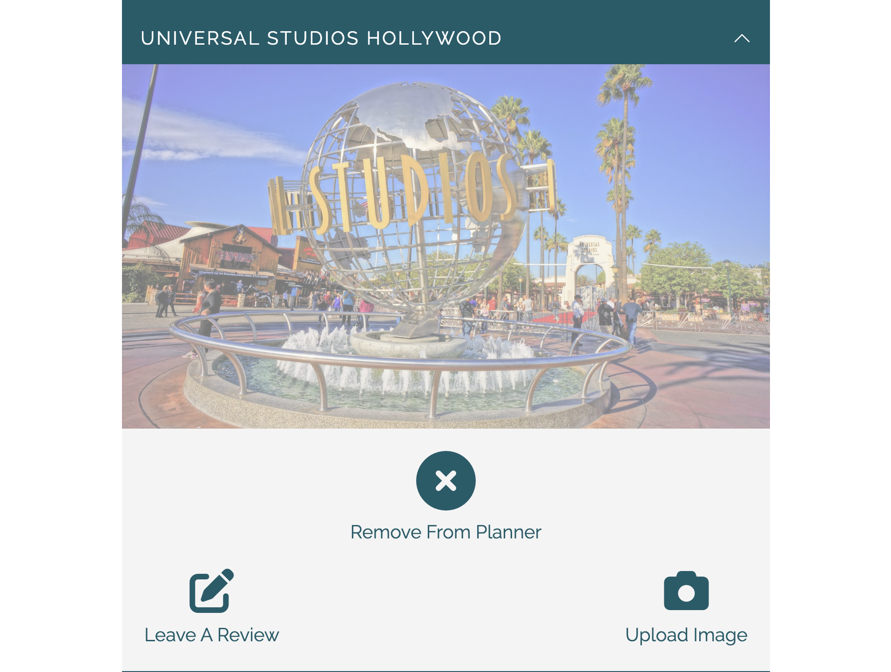

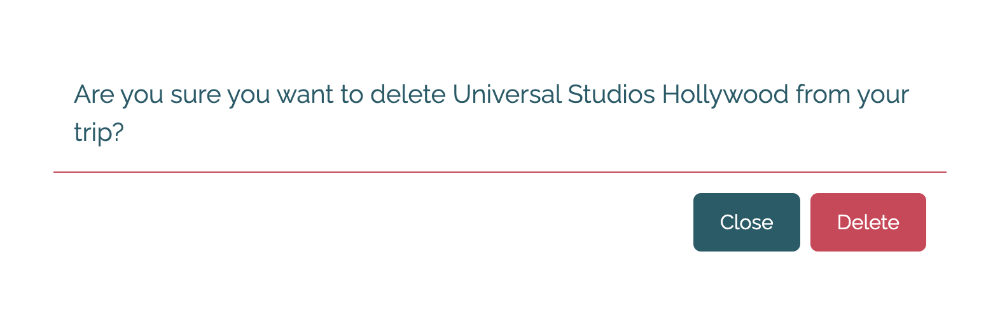

### **Place Details**

#### **Place Summary**

On naviagting to a 'place details' page, the user is presented with a summary section containing the following:

* Place Image
* Place Name
* Place Star Rating -> visually communicated using Fontawesome icons
* Add/ Remove From Trip -> This button allows the user to toggle between adding or removing the place
* More Recommendations -> This button directs the user back to the [Trip Details Page](#trip-details)

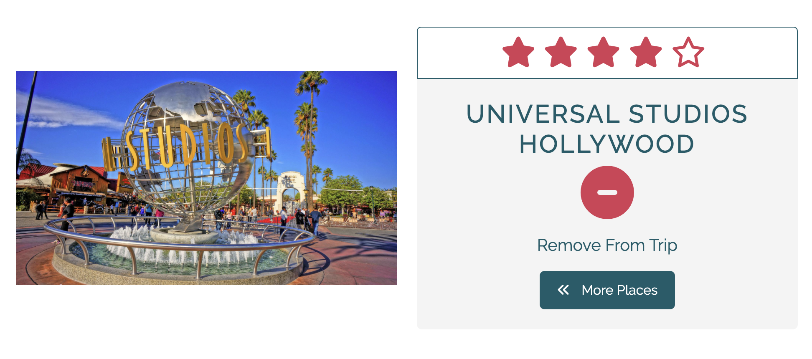

#### **Details Tab**

A full description of the place is displayed in the details navigation tab:

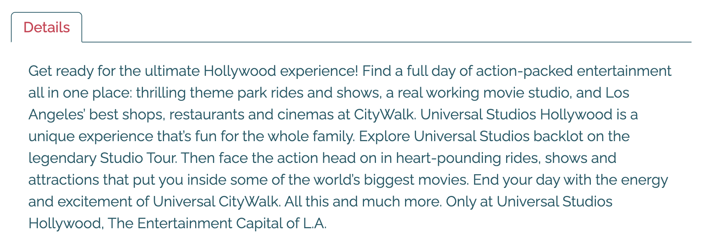

Below the description, the following details are available:

* Address
* Website if avaialble - this link opens in a new browser tab
* Google Map displaying location of the place.  This functionally was implemented with the help of the following [Google's Map Documentation](https://developers.google.com/maps/documentation/javascript/adding-a-google-map).  The following [javascript file](static/js/maps.js) is loaded at the bottom of the place detail page.

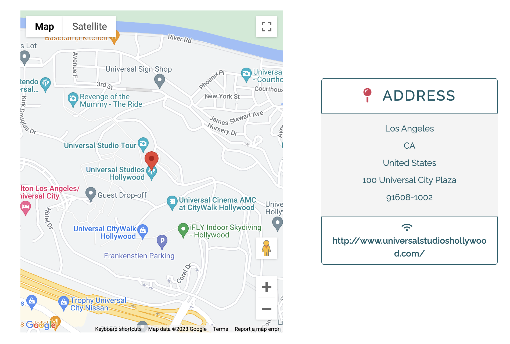

#### **Reviews Tab**

The review tab is only visible to users if a review exists for the selected place.  Reviews are displayed using the Bootstrap Carousel component and appear as clickable cards with hover effect consistent with the rest of the site.  Clicking on a card opens the full review in a modal.  Only reviews that have been approved by a site administrator will be displayed.

#### **Gallery Tab**

The gallery tab is only visible to users if images relating to the selected place have been uploaded to the site. Images are displayed as thumbnails in rows of 3.  Clicking on any of the images opens a full size version in a modal.

### **User Reviews**

From their trip itinerary, users can navigate to their 'reviews page' to leave a review for a place once they have visited.  The form is generated using django crispy forms.  Styling is done in the forms.py file for the places app.

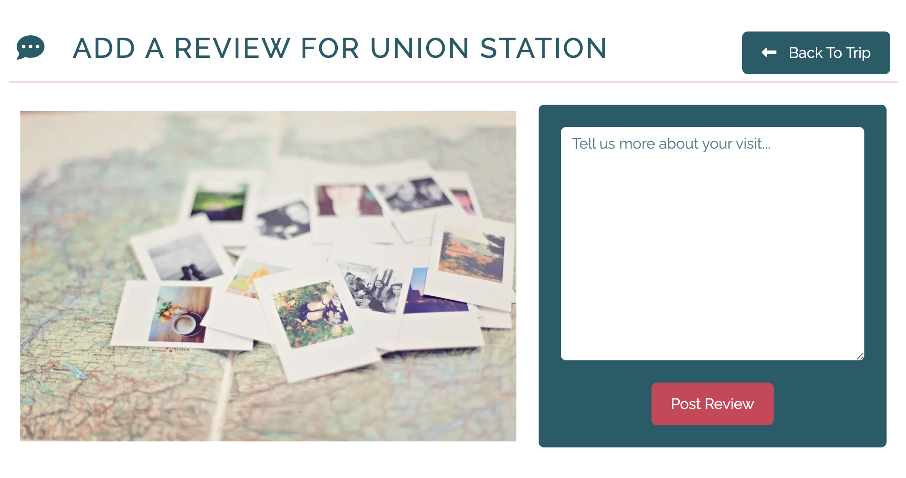

Users can also view, edit or delete any other reviews they have already left.  A confirmation modal is used to check the user really wants to delete a review before removing from the database.  Once a review has been submitted, this is immediately visible to the logged in user and they still have the ability to edit/ delete, but the review is not accessible to other site users until the content has been approved by a site administrator.

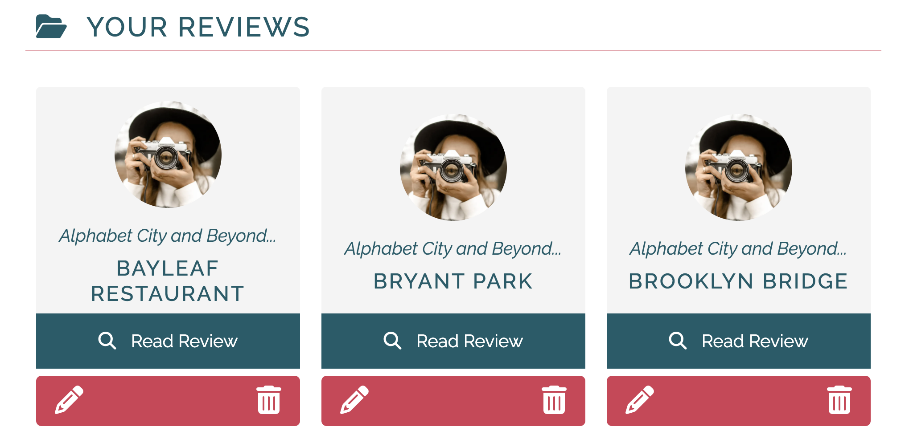

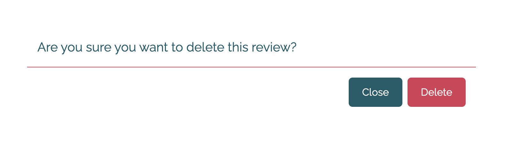

### **User Images**

Users are presented with the option to 'upload image' for each place in their trip itinerary.  Once directed to this page, they can select an image to upload:

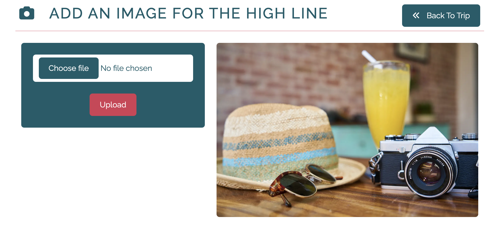

If a user has already uploaded images for other places, a gallery is displayed.  Functionality has been implemented to allow the user to 'add more' images to a place listed in the gallery, or delete an image.  A confirmation modal is used to check the user really wants to delete an image before removing from the database.  Once an image has been submitted it is immediately visible to the logged in user, but the image is not visible to other site users in the 'place gallery' tab until it has been approved by a site administrator.

### **Toasts**

Toasts are available as a Bootstrap component, and have been used in conjunction with [Django Messages](https://docs.djangoproject.com/en/4.2/ref/contrib/messages/) to provide the user with feedback as they navigate the site. This helps to communicate when an interaction has been successful or unsuccessful, therefore always keeping the user informed and providing an enhanced user experience.  

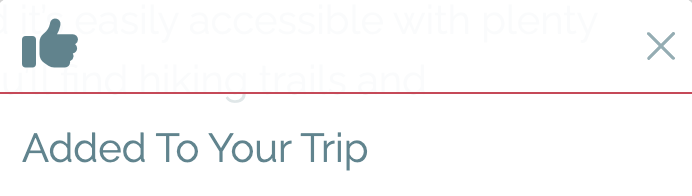

To avoid the repetition of code and to ensure that the appearance of messages is consistent across the site, the toast  html structure lives in the [messages.html](templates/includes/messages.html) file and has been included in the base.html template.

If a message is detected on page load, the following [toasts javascript file](static/js/toasts.js) is loaded which initialises the toast.

### **Role Based Login**

#### **Staff User Functionality**

Functionality is included on the site that is only available to users with 'staff' status.  These user logins can be created and provided with relevant permissions by a superuser in the [Django Admin Panel](#django-admin-panel)/. Clicking on the 'Add A Destination' directs the staff user to a page where they can create and edit destinations.

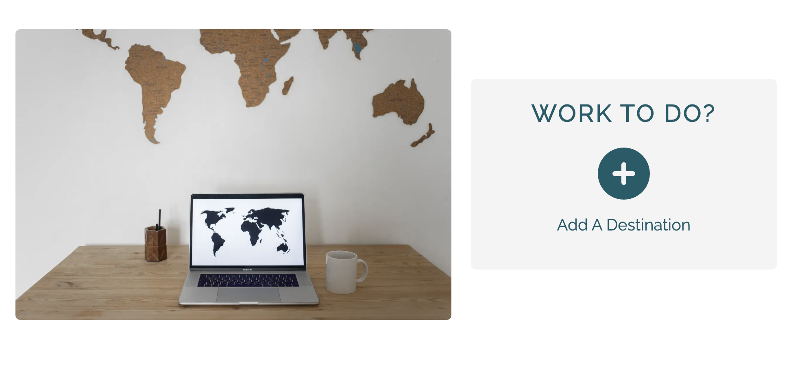

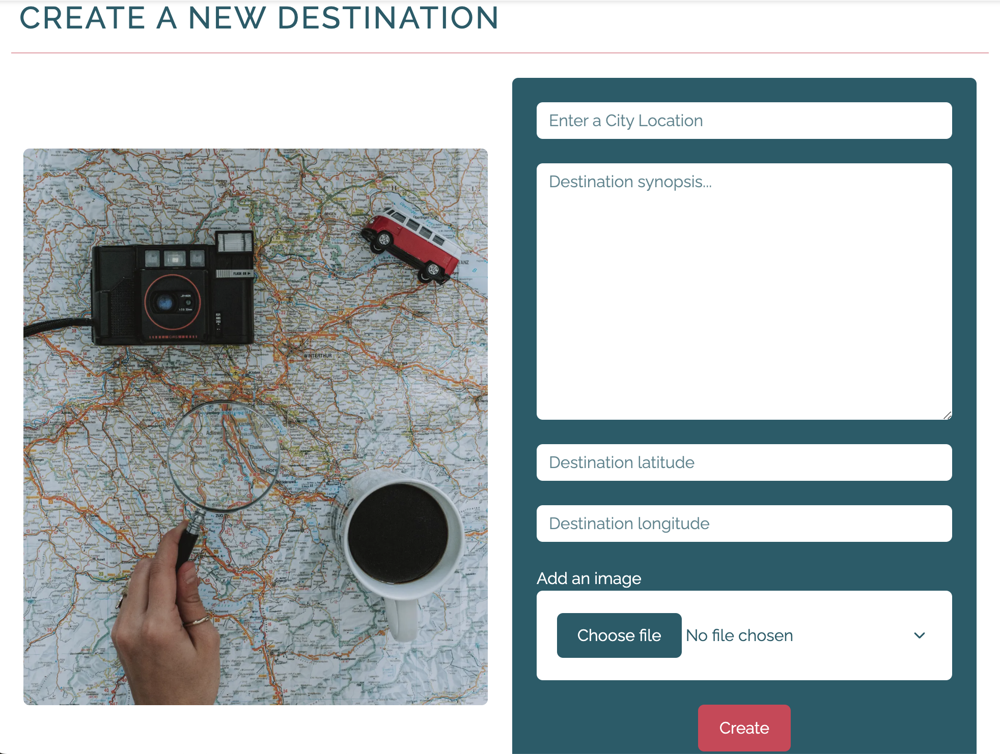

Once the location form has been succesfully populated with the required information, an instance of Location is created and saved to the database and displayed as a card in the destinations list below.  A success message is displayed in a toast to keep the user informed.  Clicking on the destination card opens the destination modal.

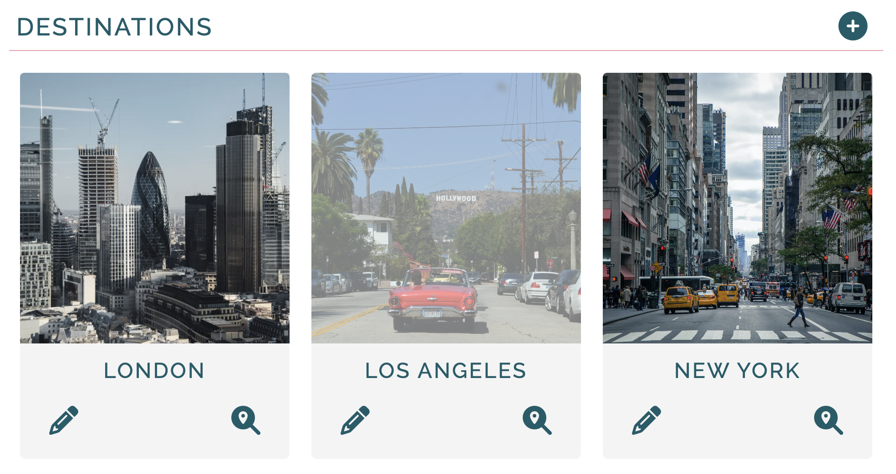

If a staff user clicks on the magnifying glass for a destination that is already populated with places, they are directed to the [place list page](#browse-places) for the selected destination.

Clicking on the pencil icon on any of the destination cards allows the staff user to update details.  The form is populated with details of the selected location, the submit button changes to 'update' and the title also changes to 'Update Details For...'

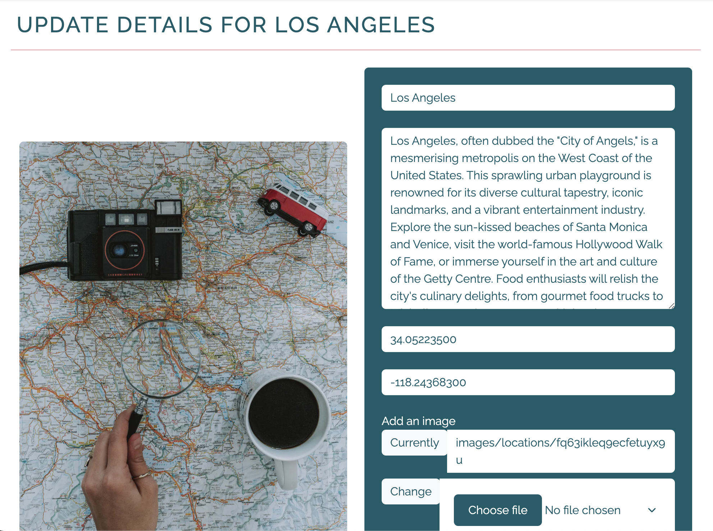

At this stage,  a newly created destination will have no recommended places associated with it.  Staff users are able to check if any places for the destination can be retrieved.  If they click on the magnifying glass icon at the bottom of a destination with no associated places, they are directed to the 'get places' page.  The form drop down menu loaction field is filtered so only locations that do not have any associated places appear.  The form is submitted and an attempt is made to retrieve places for the selected location.  Read [here](#population-of-the-places-database) about how place data is retrieved and handled.  If there is place data available for the selected location, the database will be populated and the user is redirected to the place list page for the newly populated destination.  A success message of "Places have been retrieved successfully" is displayed in a toast to keep the user informed.  If no place data is currently available, users are alerted to this with a toast message of "We were not able to retrieve this data" and they are redirected to the 'destinations' page.

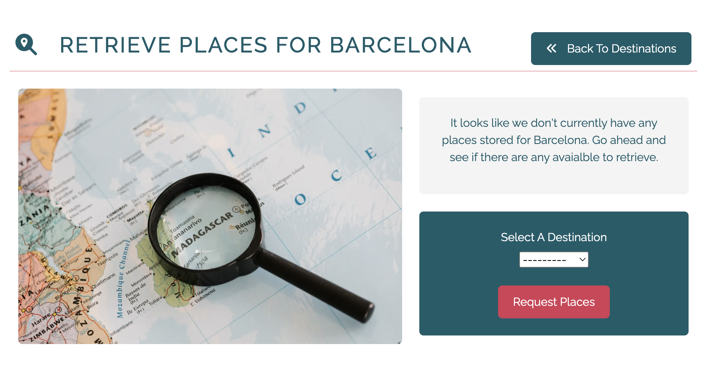

#### **Place Moderation**

I realised that an element of moderation is required on the data returned in the json response from the APIFY web scraper.  Sometimes descriptions are not worded very well or might not appear in english.  I therefore decided to build in functionality that gives staff users the ability to 'disapprove' a place when they are checking these details.  When logged in as staff and accessing the place detail page, there is an option to toggle approval.  By default, all places are approved but if the staff moderator is not satisfied with the quality of the data, they can unapprove it.  These places will subsequently not be displayed to regualar site users.  Once a place has been unapproved, it can only be re-approved via the Django admin panel.

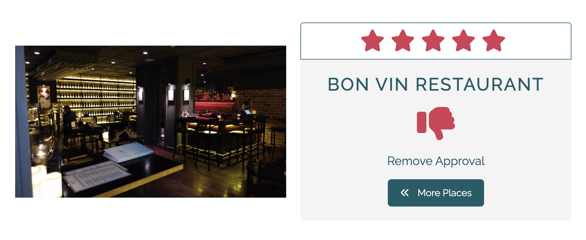

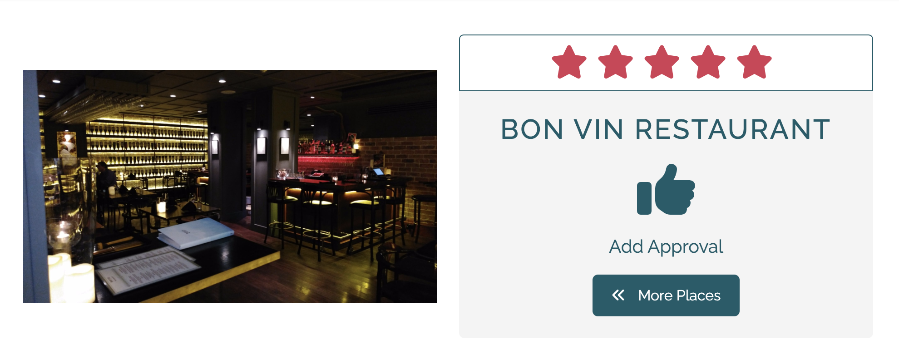

#### **Destination Moderation**

There might be an occassion, where a staff user creates a new destination but does not immediately populate with place data.  I do not want destinations displayed to regular site users until the associated content and data has been throughly checked and approved.  I therefore added an 'approved' field to the Location Model which defaults to false.  While this boolean field is set to false on an instance of a Location, it will not be avaialble to regular site users whether they are browsing or creating trips.  This field can only be set to true by a superuser in the Django Admin Panel.

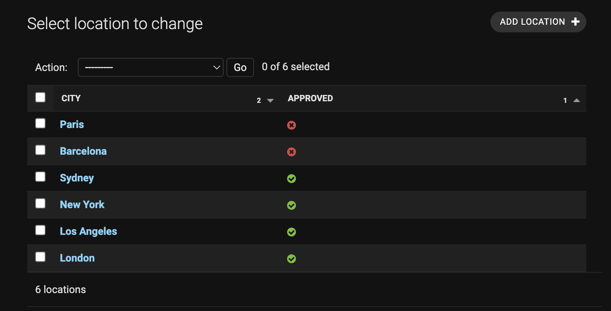

#### **Django Admin Panel**

Models for the site can be accessed and manipulated from the Django Admin panel.  The designated superuser has total control over this.  I have set up a 'moderator' login for a staff user with limited permissions in the admin panel.  They are able to view and approve reviews and images created by users.  I have customised the layout and selected display fields to be shown for each model in the Django admin panel.  Code for this has been implemented in the related admin.py files.

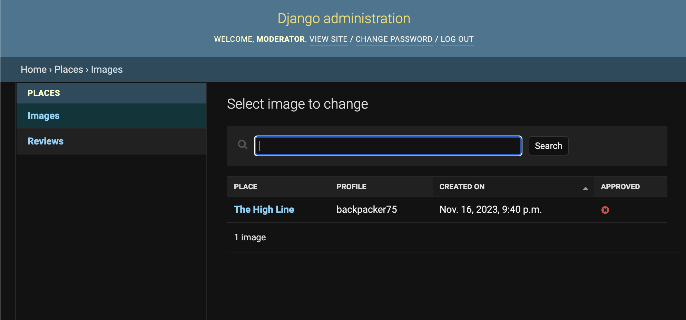

### **Error Pages**

I have included custom 403, 404 and 500 error pages as a form of defensive design. This improves the user experience by keeping the user informed about the problem and engaged with the site.  The styling imagery and branding used on these pages is consistent with the rest of the user experience.  To ensure the user does not decide to navigate away from the site, a 'Back To Home Page' button is displayed.  This also ensures they do not have to use the back button in their browser for navigation.

#### **404 Error Page**

Displayed if the user tries to access a broken link or page on the site that does not exist/ has been moved.

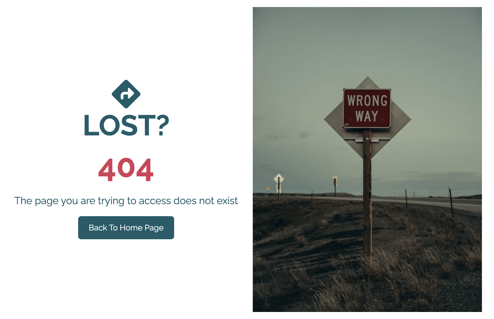

#### **403 Error Page**

Displayed if the user tries to access unauthorised content.  Read more about the defensive programming that was implemented to stop unauthorised users accessing, editing and deleting content that does not belong to them.

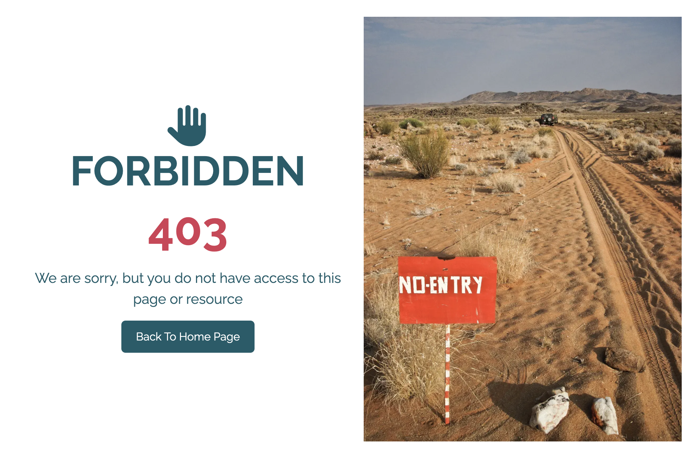

#### **500 Error Page**

Displayed to warn the user when an internal server error occurs.  This lets them know that there is a problem with the site and not at their end. They are also informed that a solution to the problem is being worked on in the hope that they will not navigate away from the site.

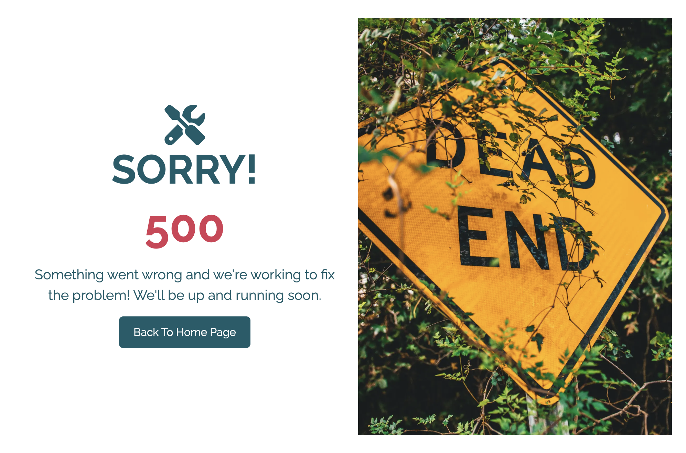

### **Favicon and Meta Tags**

### **Security**

#### **Defensive Programnming**

To secure certain Django Views and ensure they are only accessible to registered users, the ```
@login_required()``` decorator is used for function based views. 
The ```LoginRequiredMixin``` is used on any class based views where restrictions are required.  A site user that tries to access any of these restricted pages while not logged in, will be directed to the login page.

When navigating the site, logged in users are only presented with the option to edit or delete trips, reviews or images if they own them.  However simply removing this functionality from the user interface does not alone provide adequate security.  An additional layer of defensive programming has therefore been added in certain views to prevent specific URLs being targeted and modified. This code below is an example of how the profile ID linked to an image is checked against the profile ID of the currently logged in user.  Only if they match is the delete() method allowed to run on the image instance.  Otherwise a message is displayed to the user which informs them that thet can only delete their own images.

```python
if image.profile.id == request.user.profile.id:
        image.delete()
        messages.add_message(request, messages.SUCCESS, 'Image deleted!')
    else:
        messages.add_message(request, messages.ERROR, 'You can only delete your own images!')
```

#### **Protection Of Sensitive Details**

Any keys containing sensitive data were stored in and retrieved from the env.py file during development. This was added to the gitignore file to ensure this data was never pushed to the GitHub repo.  For the deployed production version of the site hosted on Heroku, these sensitive keys are stored securely in the config vars.

I have also made my best efforts to protect my Google Maps API key, which needs to be accessible in certain html templates and javascript files.  The key is passed from the back end to the front end as part of the context data.  I am then using the [json_script template tag](https://adamj.eu/tech/2020/02/18/safely-including-data-for-javascript-in-a-django-template/) so the key can be accessed in the javascript files.  This way, the key is never actually written or stored in any of the files that live in the GitHub repo.  However, if you inspect the page, you can still see the google maps key.  I spoke with my mentor about this and he confirmed that this should be ok, as I am taking extra security measures with my Google Account by setting up application restrictions that limit the API keys' usage to only website addresses that I have specified.

#### **CRSF Tokens**

CSRF tokens were used in forms across the site to protect against [Cross Site Request Forgery](https://docs.djangoproject.com/en/3.2/ref/csrf/).  When rendering forms using the crispy forms helper, these are automatically included.  For any other forms across the site, I have added manually.

### **Responsive design**

## **Future Features**

# **Technologies Used**

## **Languages Used**

* [HTML5](https://developer.mozilla.org/en-US/docs/Glossary/HTML5)
* [CSS3](https://developer.mozilla.org/en-US/docs/Web/CSS)
* [Javascript](https://developer.mozilla.org/en-US/docs/Web/JavaScript)
* [Python](https://www.python.org/)

## **Programs and Tools Used**

<br>

* [Git](https://en.wikipedia.org/wiki/Git) -  Version control.
* [GitHub](https://github.com/) - All files for the project stored and saved in a repository.
* [Gitpod](https://www.gitpod.io/) - IDE used to write the code, make git commits and push to GitHub.
* [Heroku](https://dashboard.heroku.com/apps) - For deployment of the project.
* [ElephantSQL](https://www.elephantsql.com/) - a PostgresQL database used for the deployed production site
* [Cloudinary](https://www.cloudimage.io/) - Used to store user uploaded images
* [PEP8](https://pep8ci.herokuapp.com/) - CI Python Linter
* [JSHint](https://jshint.com/) - Javascript linter
* [W3C](https://validator.w3.org/) - HTML Validator
* [W3C jigsaw](https://jigsaw.w3.org/css-validator/) - CSS Validator
* [Black](https://www.freecodecamp.org/news/auto-format-your-python-code-with-black/) - Python Auto Formatter
* [Google Lighthouse](https://developer.chrome.com/docs/lighthouse/overview/) - Used at testing stage to show statistics for performance, accessibility, best practices and SEO.
* [Google DevTools](https://developer.chrome.com/docs/devtools/) - Used throughout build of website for debugging, checking responsiveness and trialing new features/ styling.
* [Google Fonts](https://fonts.google.com/) - Used to import required fonts for the website via the css style page.
* [dbdiagram](https://dbdiagram.io/home) - Database Relationship Diagrams Design Tool
* [Balsamiq](https://balsamiq.com/wireframes/) - Used to create wireframes.
* [Font Awesome](https://fontawesome.com/) - Used for all icons throughout the website.
* [TinyPNG](https://tinypng.com/) - For compression of image files to improve website performance.
* [Birme](https://www.birme.net/?target_width=425&target_height=450&auto_focal=false&image_format=jpeg&quality_jpeg=100&quality_webp=100) - For resizing and re-formatting images to make them suitable for use on the website.
* [Favicon.ico & App Icon Generator](https://www.favicon-generator.org/) - For creating the 16x16px ico favicon.
* [Techsini](https://techsini.com/multi-mockup/index.php) - For displaying images of how the website looks across a range of devices.
* [Meta Tags IO](https://metatags.io/) - For improving site visual appearance on social media.
* [Stackoverflow](https://stackoverflow.com/) - Used for researching solutions/ fixing bugs

<br>

## **Frameworks and Libraries Used**

* cloudinary - Python library to facilitate integration of cloudinary with Django

# **Testing**

Please follow this link to the [TESTING.md file](https://github.com/rkillickdev/plan-it-go/blob/main/TESTING.md), for documentation about the testing procedure I followed for this project.

# **Deployment and Local Development**

# **Bugs**

## **Known Bugs**

## **Solved Bugs**

Below are bugs that were discovered during development and testing.  I have not listed some of the smaller quick fixes that were implemented during the testing phase, but they were raised as 'bug' issues on GitHub and can be seen as part of my [Project Kanban Board]((docs/features/agile/pp4-agile-kanban-board.png)).

| Bug Description | Solution |
| ------------ | --------------- |
| ModuleNotFoundError when using Django allauth | I found this [article](https://stackoverflow.com/questions/77012106/django-allauth-modulenotfounderror-no-module-named-allauth-account-middlewar) on the problem.  The solution was to insert: ```'allauth.account.middleware.AccountMiddleware'``` in MIDDLEWARE in the settings.py file.  This is required for allauth version 0.56.0 |
| I deployed the site to Heroku early and encountered an issue where no static files were being collected.  I am using whitenoise to host my static files | The solution was that under `INSTALLED APPS` in the settings.py file, `django.contrib.staticfiles` must be listed **BEFORE** `cloudinary_storage`, otherwise `collectstatic` does not work.  I found this [great post](https://code-institute-room.slack.com/archives/C026PTF46F5/p1683039292374329) in the Code Institute Slack channels that helped me solve the issue fairly quickly |
| I discovered that once a review had been submitted on the reviews page, refreshing the browser would result in another identical review being created | For the review_create view (trips/view.py),I added an ```HttpResponseRedirect``` for any requests with the 'POST' method.  Prior to this, both POST and GET requests were using render, and this was causing the problem when posting a review. |
| Addresses displaying ```None``` as a value on the place detail / browse detail pages | I discovered that within the address object of place json data returned by the web scraper, some empty address lines would be represented as an empty string and some as Null which then showed as None when the json data was parsed by python.  I added an additional conditional statement to the single_place_info.html template on line 74, which now reads as ``````.  This checks if there is any value at all, and then goes on to check whether this value is an empty string.  It must satisfy these two conditions to then render the value to the template. |
| Defensive programming missing on trip and profile views | Add defensive programming where necessay using ```raise PermissionDenied()```.  View [GitHub Issue#44](https://github.com/rkillickdev/plan-it-go/issues/44) to see the full steps taken to resolve |
| If Image links that are loaded from external sources such as the https://media-cdn.tripadvisor.com/ or Cloudinary are broken/ return an error, there was no defensive programming in place to ensure a replacement image is displayed | I wrote a javascript file to listen for errors on any image tags on the page.  If an error is detected, a placeholder image is loaded from the static/images folder is loaded.  View [GitHub Issue#45](https://github.com/rkillickdev/plan-it-go/issues/45) to see the full steps taken to resolve |
| Profile form submit button displaying 'Create Profile' if user is updating their profile | Wrote the forms.js javascript file determine form status and change the submit button value to 'Update' if required. View [GitHub Issue#47](https://github.com/rkillickdev/plan-it-go/issues/47) |
| Google maps markers not displaying the correct place names on hover/ clicking | I needed to pass the place name to the maps.js and map-cluster.js javascript files from the html template.  I did this using the json_script template tag, and then used this to label the map markers.  View [GitHub Issue#49](https://github.com/rkillickdev/plan-it-go/issues/49) |
| Destination carousel cards displaying incorrect information when opened in modal |. To solve this, I reverted back to only wrapping the img element of the card in the button to trigger the modal. View [GitHub Issue#50](https://github.com/rkillickdev/plan-it-go/issues/50) |
| I noticed side scrolling was necessary on the profile page when viewing on smaller mobile devices |  I discovered that the issue was being caused by overflow from the image file select field.  I added the "form-select" class to any form with a file input field.  This has prevented overspill and solved the problen of side scrolling.  View [GitHub Issue#54](https://github.com/rkillickdev/plan-it-go/issues/54) | 


Include Proc File details


