# **PlanitGo Testing**

## **Testing Overview**

## **CONTENTS**

* [Manual Testing](#manual-testing)
    * [Full Testing](#full-testing)
    * [Defensive Testing](#defensive-testing)
    * [Form Testing](#form-testing)
    * [User Story Testing](#user-story-testing)
    * [Javascript Testing](#javascript-testing)
* [Automated Testing](#automated-testing)
* [Validator](#validators)
    * [PEP8 Validation](#pep8-validation)
    * [W3C Markup HTML Validator](#w3c-html-markup-validator)
    * [W3C CSS Validator](#w3c-css-validator)
* [Performance](#performace)
    * [Lighthouse](#lighthouse)
    * [Wave Accessibility](#wave-accessibility)

## **Manual Testing**

### **Full Testing**

#### **Homepage**

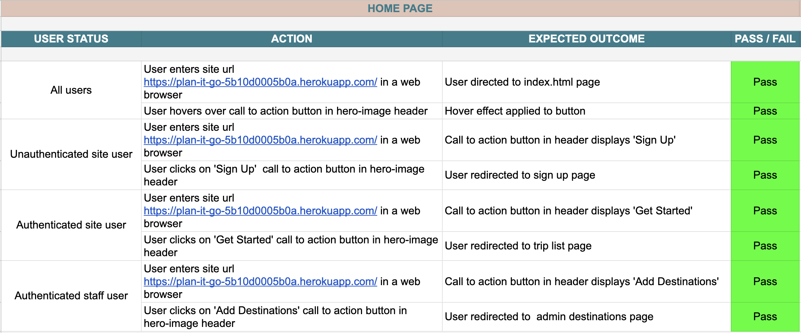
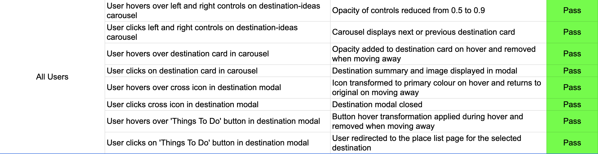

#### **Navbar**


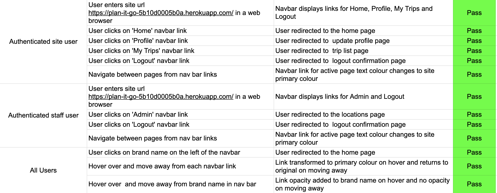

#### **Footer**

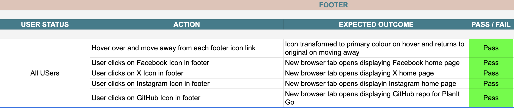

#### **AllAuth**

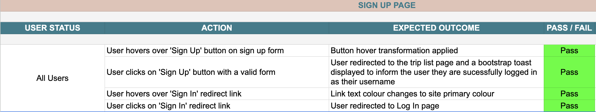
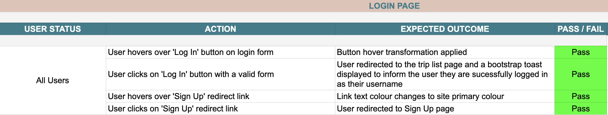

#### **Trip List**

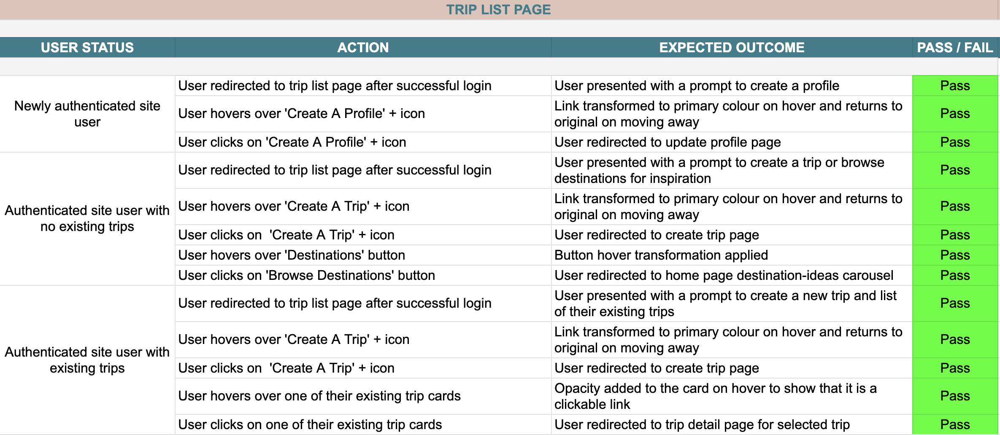

#### **Profile Page**

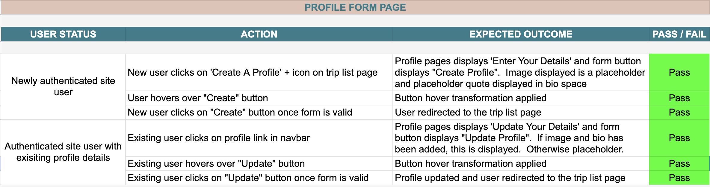

#### **Create Trip Page**

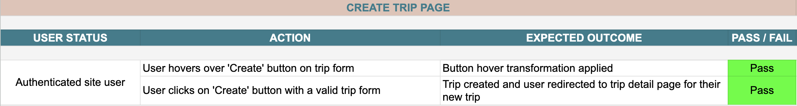

#### **Trip Detail Page**

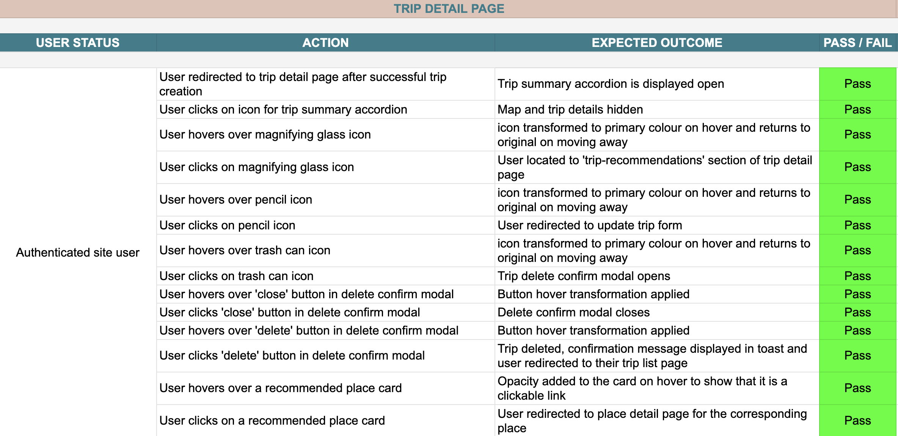
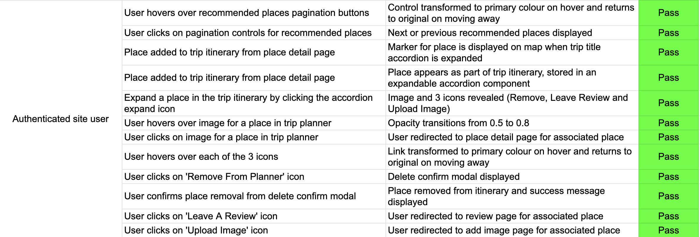

#### **Place Detail Page**

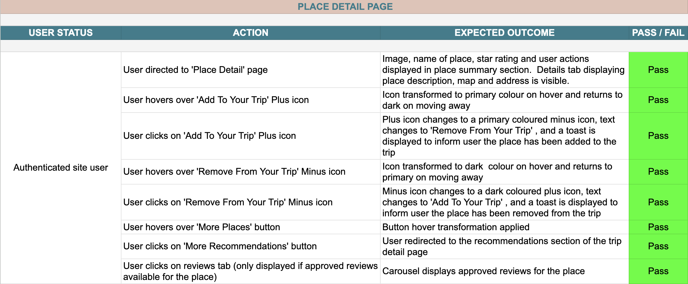
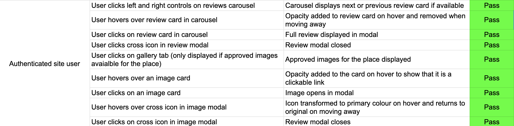

#### **Review Page**

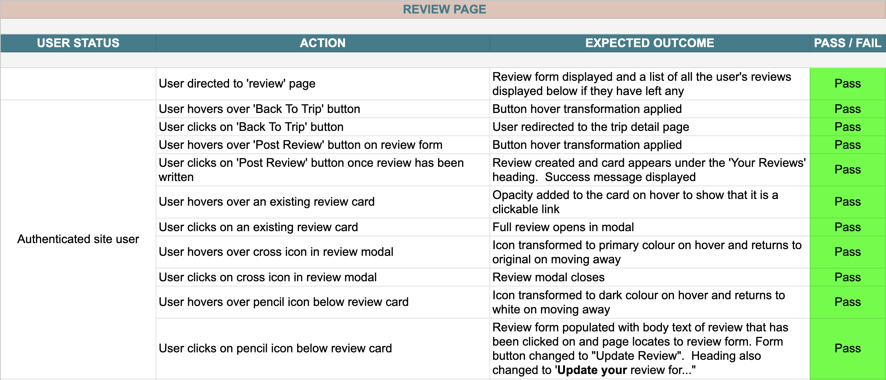
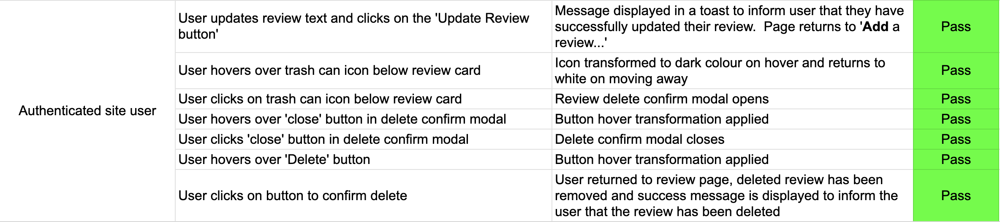

#### **Add Image Page**

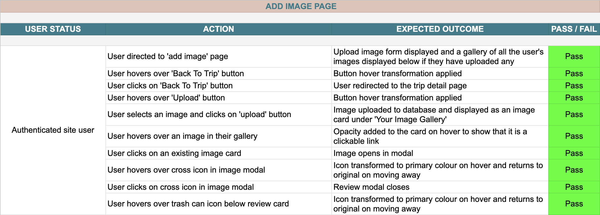
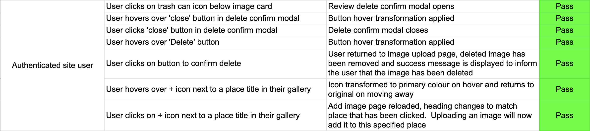

#### **Place List Page**

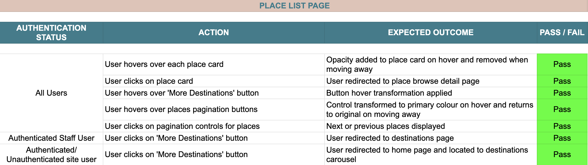

#### **Browse Detail Page**

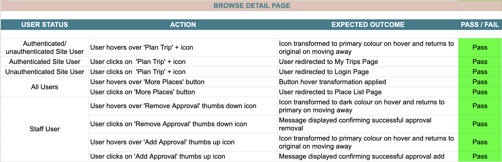

#### **Destinations Page (Staff Only)**

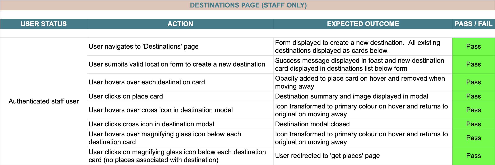
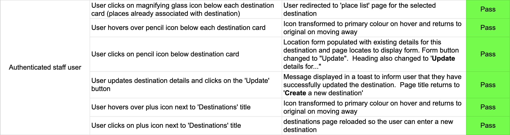

#### **Get Places Page (Staff Only)**

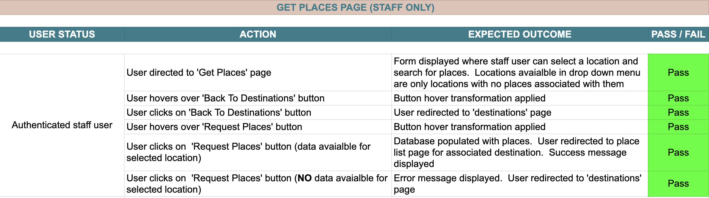

### **Defensive Testing**

I have carried out a range of tests to check that any defensive programming implemented in the code is operating as expected.  These tests confirm that site users cannot access pages without the correct permission to do so, even if they enter valid urls.

#### **User Status: Not logged in**

| URL Tested | Expected Outcome | Pass/Fail |
| ---- | ---- | ---- |
| https://plan-it-go-5b10d0005b0a.herokuapp.com/profiles/update_profile/6 | User directed to login page | Pass |
| https://plan-it-go-5b10d0005b0a.herokuapp.com/trips/update_trip/manhattan-2023/6 | User directed to login page | Pass |
| https://plan-it-go-5b10d0005b0a.herokuapp.com/trips/manhattan-2023/delete_trip/6 | User directed to login page | Pass |
| https://plan-it-go-5b10d0005b0a.herokuapp.com/trips/manhattan-2023/6 | User directed to login page | Pass |
| https://plan-it-go-5b10d0005b0a.herokuapp.com/trips/manhattan-2023/6/place/19/ | User directed to login page | Pass |
| https://plan-it-go-5b10d0005b0a.herokuapp.com/trips/manhattan-2023/6/review/19/ | User directed to login page | Pass |
| https://plan-it-go-5b10d0005b0a.herokuapp.com/trips/manhattan-2023/6/review/19/edit_review/5 | User directed to login page | Pass |
| https://plan-it-go-5b10d0005b0a.herokuapp.com/trips/manhattan-2023/6/review/19/delete_review/5 | User directed to login page | Pass |
| https://plan-it-go-5b10d0005b0a.herokuapp.com/trips/manhattan-2023/6/images/19/ | User directed to login page | Pass |
| https://plan-it-go-5b10d0005b0a.herokuapp.com/trips/manhattan-2023/6/images/19/delete_image/3 | User directed to login page | Pass |
| https://plan-it-go-5b10d0005b0a.herokuapp.com/locations/ | User directed to login page | Pass |
| https://plan-it-go-5b10d0005b0a.herokuapp.com/places/get_places/3/london | User directed to Django Admin Login page | Pass |

#### **User Status: Logged in attempting to access unauthorised urls**

| URL Tested | Expected Outcome | Pass/Fail |
| ---- | ---- | ---- |
| https://plan-it-go-5b10d0005b0a.herokuapp.com/profiles/update_profile/6 | 403 permission denied template displayed | Pass |
| https://plan-it-go-5b10d0005b0a.herokuapp.com/trips/update_trip/manhattan-2023/6 | 403 permission denied template displayed | Pass |
| https://plan-it-go-5b10d0005b0a.herokuapp.com/trips/manhattan-2023/delete_trip/6 | 403 permission denied template displayed | Pass |
| https://plan-it-go-5b10d0005b0a.herokuapp.com/trips/manhattan-2023/6 | 403 permission denied template displayed | Pass |
| https://plan-it-go-5b10d0005b0a.herokuapp.com/trips/manhattan-2023/6/place/19/ | 403 permission denied template displayed | Pass |
| https://plan-it-go-5b10d0005b0a.herokuapp.com/trips/manhattan-2023/6/review/19/ | 403 permission denied template displayed | Pass |
| https://plan-it-go-5b10d0005b0a.herokuapp.com/trips/manhattan-2023/6/review/19/edit_review/5 | 403 permission denied template displayed | Pass |
| https://plan-it-go-5b10d0005b0a.herokuapp.com/trips/manhattan-2023/6/review/19/delete_review/5 | 403 permission denied template displayed | Pass |
| https://plan-it-go-5b10d0005b0a.herokuapp.com/trips/manhattan-2023/6/images/19/ | 403 permission denied template displayed | Pass |
| https://plan-it-go-5b10d0005b0a.herokuapp.com/trips/manhattan-2023/6/images/19/delete_image/3 | 403 permission denied template displayed | Pass |
| https://plan-it-go-5b10d0005b0a.herokuapp.com/locations/ | User directed to Django Admin Login page | Pass |
| https://plan-it-go-5b10d0005b0a.herokuapp.com/places/get_places/3/london | User directed to Django Admin Login page | Pass |

### **Form Testing**

### **User Story Testing**

#### **EPIC: User Account [#1](https://github.com/rkillickdev/plan-it-go/issues/1)**

| As a Site User I can register an account so that I can access features only available to registered users such as creating and planning trips [#2](https://github.com/rkillickdev/plan-it-go/issues/2) |
| ---- | 
| Ho is it achieved |

| As a Site User I can log in to my account so that I can create, view, update and delete my trips [#3](https://github.com/rkillickdev/plan-it-go/issues/3) |
| ---- |
|.     |

| As a Site User I can log out of my account for security so that no one else can access or modify my trips [#4](https://github.com/rkillickdev/plan-it-go/issues/4) |
| ---- |
||

| As a Site User I am aware of my login status so I know whether I can carry out actions available only to logged in users [#5](https://github.com/rkillickdev/plan-it-go/issues/5) |
| ---- |
||

| As a Site User I can create and update a user profile for my account so that I can personalise my details with a screen name, image and bio [#6](https://github.com/rkillickdev/plan-it-go/issues/6) |
| ---- |
||

| As a Site Administrator I can moderate user reviews so that I can decide whether the content and images are appropriate for other site users to view [#34](https://github.com/rkillickdev/plan-it-go/issues/34) |
| ---- |
||

| As a Site Administrator I can access models from the Django admin panel so that I can interact directly with the database [#35](https://github.com/rkillickdev/plan-it-go/issues/35) |
| ---- |
||

| As a user with staff status I can add and amend details for destinations so that the content on the site can continually be expanded and updated [#39](https://github.com/rkillickdev/plan-it-go/issues/39) |
| ---- |
||

| As a user with staff status I can add places for a destination to the database so that site users can browse these recommended places and add to their trips [#40](https://github.com/rkillickdev/plan-it-go/issues/40) |
| ---- |
||

| As an admin superuser I can customise the django admin panel so that I can order and filter instances of models [#42](https://github.com/rkillickdev/plan-it-go/issues/42) |
| ---- |
||

| As a staff user I can moderate places through the site interface so that I can ensure places with sufficient quality info are displayed to site users [#61](https://github.com/rkillickdev/plan-it-go/issues/61) |
| ---- |
||

#### **EPIC: Plan Trip [#7](https://github.com/rkillickdev/plan-it-go/issues/7)**

| As a Site User I can create a personalised trip planner for a chosen destination so that I can start planning places to visit on my trip [#8](https://github.com/rkillickdev/plan-it-go/issues/8) |
| ---- |
||

| As a Site User I can view recommended activities for the chosen location so that I can plan a bespoke itinerary for the trip that appeals to my tastes and interests [#9](https://github.com/rkillickdev/plan-it-go/issues/9) |
| ---- |
||

| As a Site User I can view details of a specific place so that I can decide whether I should add it to my itinerary [#10](https://github.com/rkillickdev/plan-it-go/issues/10) |
| ---- |
||

| As a Site User I can add a recommendation to my trip planner so that I can build an itinerary to use and refer to when travelling to the location [#11](https://github.com/rkillickdev/plan-it-go/issues/11) |
| ---- |
||

| As a Site User I can remove places from my trip planner so that I can have control over building an itinerary and change my mind about places that were previously added [#12](https://github.com/rkillickdev/plan-it-go/issues/12) |
| ---- |
||

| As a Site User I can choose to view my current trip itinerary at any point during planning so that I can keep track of places I have added [#13](https://github.com/rkillickdev/plan-it-go/issues/13) |
| ---- |
||

| As a Site User I can edit my trip itinerary by removing a place or adding more so that I can continue modifying my plans [#14](https://github.com/rkillickdev/plan-it-go/issues/14) |
| ---- |
||

| As a Site User I can save all the places in my trip itinerary so that I can return to my planning at any time [#15](https://github.com/rkillickdev/plan-it-go/issues/15) |
| ---- |
||

| As a user I can see a countdown to my trip so that I know how many days until I travel [#36](https://github.com/rkillickdev/plan-it-go/issues/36) |
| ---- |
||

| As a user I can filter recommended places so that I can build an itinerary tailored to my interests [#37](https://github.com/rkillickdev/plan-it-go/issues/37) |
| ---- |
||

| As a user I can see places visually on a map so that I can see where they are and plan a route [#38](https://github.com/rkillickdev/plan-it-go/issues/38) |
| ---- |
||

| As a user I can view place ratings displayed as stars so that I can immediately understand the popularity of a place [#41](https://github.com/rkillickdev/plan-it-go/issues/41) |
| ---- |
||

#### **EPIC: Manage Trip [#16](https://github.com/rkillickdev/plan-it-go/issues/16)**

| As a Site User I can view a summary of all upcoming and completed trips so that I can choose one to view or edit [#17](https://github.com/rkillickdev/plan-it-go/issues/17) |
| ---- |
||

| As a Site User I can select a trip so that I can view or edit details of the itinerary [#18](https://github.com/rkillickdev/plan-it-go/issues/18) |
| ---- |
||

| As a Site User I can mark places on a trip itinerary as completed so that I can keep track of places that I have visited while travelling [#19](https://github.com/rkillickdev/plan-it-go/issues/19) |
| ---- |
||

| As a Site User I can delete an entire trip so that I have control of the trips that are stored in my user account [#20](https://github.com/rkillickdev/plan-it-go/issues/20) |
| ---- |
||

#### **EPIC: Review [#21](https://github.com/rkillickdev/plan-it-go/issues/21)**

| As a Site User I can write a review of a place on my itinerary so that I can share my experiences of the visit with other site users [#22](https://github.com/rkillickdev/plan-it-go/issues/22) |
| ---- |
||

| As a Site User I can edit my review so that I can update the content or correct grammatical errors [#23](https://github.com/rkillickdev/plan-it-go/issues/23) |
| ---- |
||

| As a Site User I can delete my review so that I can have control of reviews if I decide they are no longer relevant or necessary [#24](https://github.com/rkillickdev/plan-it-go/issues/24) |
| ---- |
||

| As a Site User I can decide whether I would recommend a place so that I can help other site users to make decisions when planning places to visit on their trip [#25](https://github.com/rkillickdev/plan-it-go/issues/25) |
| ---- |
||

| As a Site User I can upload images for a place on my itinerary so that I can store the memories from my trip and share these experiences with other site users [#26](https://github.com/rkillickdev/plan-it-go/issues/26) |
| ---- |
||

| As a Site User I can delete images that I have uploaded for a place so that I can have control over which images are viewable [#27](https://github.com/rkillickdev/plan-it-go/issues/27) |
| ---- |
||

#### **EPIC: User Experience [#28](https://github.com/rkillickdev/plan-it-go/issues/28)**


| As a Site User I can immediately understand the purpose of the site when I arrive at the home page so that I can quickly and intuitively start planning trips [#29](https://github.com/rkillickdev/plan-it-go/issues/29) |
| ---- |
||

| As a Site User I can intuitively navigate the site so that I can view the content I require with minimal steps [#30](https://github.com/rkillickdev/plan-it-go/issues/30) |
| ---- |
||

| As a Site User I can view site content simply and intuitively so that I can easily gather the information I need [#31](https://github.com/rkillickdev/plan-it-go/issues/31) |
| ---- |
||

| As a Site User I **feel a positive emotional response while interacting with the site ** so I am engaged and continue to use and return [#32](https://github.com/rkillickdev/plan-it-go/issues/32) |
| ---- |
||

| As a Site User I can view the site on a range of screen sizes so that I can enjoy good user experience on my device of choice [#33](https://github.com/rkillickdev/plan-it-go/issues/33) |
| ---- |
||

| As a user I can access links to social media accounts related to the site so that I can find out more about the site and its developer [#46](https://github.com/rkillickdev/plan-it-go/issues/46) |
| ---- |
||

### **Javascript Testing**

| File | Action | Expected Outcome | Pass/Fail |
| ---- | ---- | ---- | ---- |
| static/js/delete-confirm-modals.js | Click on a trash can icon | Delete confirm modal opens and href for delete button populated with correct url to delete selected trip/ review /image.  Clicking delete confirms and triggers the correct Django view | Pass | 
| static/js/delete-confirm-modals.js | Click on Remove From Planner icon for a place in an itinerary | Delete confirm modal opens and action for delete button populated with correct url to trigger the remove_place view in Django | Pass |
| static/js/forms.js | Navigate to a page that displays a form to create a trip / review / location | Submit button on form displayed as "Create" | Pass |
| static/js/forms.js | Navigate to a page that displays a form to update a trip / review / location | Submit button on form displayed as "Update" | Pass |
| static/js/hero-text-replace.js | Navigate to Home page | Text overlaying hero image rotates between displaying 'Plans' / "Memories' / 'It Happen' | Pass |
| static/js/img-src-backups.js | Navigate to a page where the src for an image is served from an external site and an error is returned | Placeholder url injected into src for the image with a broken link | CHECK |
| static/js/map-cluster.js | Navigate to trip detail page | Google Map for the specified trip location displayed with markers identifying each place that has been added to the trip itinerary | Pass |
| static/js/maps.js | Navigate to place detail or browse detail page | Google Map for the specified place displayed with a marker to pinpoint the exact location | Pass |
| static/js/reviews.js | Click pencil icon under a review card to edit review | Text area of form populated with review content. Submit button changed to display 'Update'. Review form action attribute injected with correct url to trigger the review_edit view for the selected review | Pass |
| static/js/solo-display-modals.js | Click a destination / review / image clickable card | Modal opens displaying full destination description/ full review body text / full image | Pass |
| static/js/star-rating.js | Navigate to place detail or browse detail page | Rating for selected place displayed using font awesome full, half and empty stars to accurately visualise the correct rating | Pass |
| static/js/toasts.js | Carry out actions that prompt user feed back (e.g. Create trip, remove place from planner, delete review) | Confirmation message displays in bootstrap toast and dissapears after a few seconds | Pass |

## **Automated Testing**

### **Unit Testing**

## **Validators**

### **PEP8 Validation:**

<br>

I passed all python files through the [Code Institute Python Linter](https://pep8ci.herokuapp.com/) and no errors are found. Results of this tesing can be seen below:

<br>

App: planitgo

| File | Errors | Result |
| :----: | :-------: | :------: |
| asgi.py | 0 | Passed |
| settings.py | 0 | Passed |
| urls.py | 0 | Passed |
| wsgi.py | 0 | Passed |

App: home

| File | Errors | Result |
| :----: | :-------: | :------: |
| admin.py | 0 | Passed |
| apps.py | 0 | Passed |
| models.py | 0 | Passed |
| tests.py | 0 | Passed |
| urls.py | 0 | Passed |
| views.py | 0 | Passed |

App: locations

| File | Errors | Result |
| :----: | :-------: | :------: |
| admin.py | 0 | Passed |
| apps.py | 0 | Passed |
| forms.py | 0 | Passed |
| models.py | 0 | Passed |
| test_views.py | 0 | Passed |
| urls.py | 0 | Passed |
| views.py | 0 | Passed |

App: places

| File | Errors | Result |
| :----: | :-------: | :------: |
| admin.py | 0 | Passed |
| apps.py | 0 | Passed |
| forms.py | 0 | Passed |
| models.py | 0 | Passed |
| test_views.py | 0 | Passed |
| urls.py | 0 | Passed |
| views.py | 0 | Passed |

App: profiles

| File | Errors | Result |
| :----: | :-------: | :------: |
| admin.py | 0 | Passed |
| apps.py | 0 | Passed |
| forms.py | 0 | Passed |
| models.py | 0 | Passed |
| test_models.py | 0 | Passed |
| test_views.py | 0 | Passed |
| urls.py | 0 | Passed |
| views.py | 0 | Passed |

App: trips

| File | Errors | Result |
| :----: | :-------: | :------: |
| admin.py | 0 | Passed |
| apps.py | 0 | Passed |
| forms.py | 0 | Passed |
| models.py | 0 | Passed |
| test_models.py | 0 | Passed |
| test_views.py | 0 | Passed |
| urls.py | 0 | Passed |
| views.py | 0 | Passed |

Main Directory:

| File | Errors | Result |
| :----: | :-------: | :------: |
| env.py | 0 | Passed |
| manage.py | 0 | Passed |


### **W3C HTML Markup Validator**

All pages have been run through the [W3C](https://validator.w3.org/).  Initially a couple of recurring errors appeared in various templates.  These are outlined below and have now been resolved:

• Custom attributes had been used throughout, but I had not prepended these with [**data-**](https://www.geeksforgeeks.org/what-are-custom-attributes-in-html5/).  These attributes have now been corrected.

• The following error appeared when trying to trigger the review modal by wrapping the review cards in a button: <br>
```Error: Element div not allowed as child of element button in this context. (Suppressing further errors from this subtree.)``` <br>
I solved this error by triggering the modal from a div, with a role attribute "button" and an aria label for accessibility.

It was not possible to copy and paste the html templates into the validator, due to the Django templating language being used.   Pages that can be accessed without user authentication were validated using the direct url.  However, any pages that require user login cannot be validated using the URL.  Instead, I visited each page as an authenticated user and retrieved the html code by right clicking and selecting *View Page Source*.  I then selected Validate by Direct Input on the W3C validator and pasted this raw HTML.

| Page | Errors | Warnings| Result |
| ---- | -------| --------| ------ |
| [Index.html](docs/testing/validation/html/index_html.png) | 0 | 0 | Passed |
| [place_list.html](docs/testing/validation/html/place_list_html.png) | 0 | 0 | Passed |
| [browse_detail.html](docs/testing/validation/html/browse_detail_html.png) | 0 | 0 | Passed |
| [login.html](docs/testing/validation/html/login_html.png) | 0 | 0 | Passed |
| [signup.html](docs/testing/validation/html/sign_up_html.png) | 0 | 0 | Passed |
| [trip_list.html](docs/testing/validation/html/trip_list_html.png) | 0 | 0 | Passed |
| [create_trip.html](docs/testing/validation/html/create_trip_html.png) | 0 | 1 | Passed |
| [profile_form.html](docs/testing/validation/html/profile_form_html.png) | 0 | 1 | Passed |
| [trip_detail.html](docs/testing/validation/html/trip_detail_html.png) | 0 | 0 | Passed |
| [place_detail.html](docs/testing/validation/html/place_detail_html.png) | 0 | 0 | Passed |
| [review.html](docs/testing/validation/html/review_html.png) | 0 | 0 | Passed |
| [add_image.html](docs/testing/validation/html/add_image_html.png) | 0 | 1 | Passed |
| [logout.html](docs/testing/validation/html/logout_html.png) | 0 | 0 | Passed |
| [destinations.html](docs/testing/validation/html/destinations_html.png) | 0 | 1 | Passed |
| [get_places.html](docs/testing/validation/html/get_places_html.png) | 0 | 0 | Passed |

• There was a warning that appeared on any page that contains a form with an upload image field:

```
Warning: The type: attribute is unnecessary for JavaScript resources.
```

### **W3C CSS Validator**

## **Performace**

### **Lighthouse**

#### Improvements

I used Lighthouse within Google Chrome developer tools as a way of testing performance, accessibility, best practices and SEO of the site.  On initial testing, there were several improvement possibilities flagged which I implemented.  On doing so, accessibility, best practices and SEO scores are now at **100** across the site.  The improvements I made are listed below:

* Some links that were only represented as font awesome icons did not have discernible names.  This was also the case for some stretched links.  I added aria labels to these to improve accessibility.
* Ensured all heading elements appear in a sequentially descending order.
* I added ```aria-hidden="true"``` to carousel button controls and followed the bootstrap documentation to make the carousel accessible.
* I was initially triggering modals using an anchor link, but ligthouse alerted me to the fact that these links were [not crawlable](https://developers.google.com/search/docs/crawling-indexing/links-crawlable?visit_id=638351626897775578-1280043289&rd=1). I resolved this by using a button elelment to trigger these modal instead.

#### Opportunities

Several opportunities were flagged by the lighthouse report to improve performance which was particularly when resting for mobile:

* ```Eliminate render-blocking resources```<br>
The main offender here was the bootstrap css file. I have attempted to improve load times by only importing bootstrap components that are being used into my scss file before compiling to css.  I have also minified the compiled css to reduce file size and results have improved

*```Properly size images / serve images in next-gen formats```<br>
The images referred to here are served by the trip advisor cdn, so I have not been able to alter the size or format of these files.  Having tested the site on various devices and networks, the issue does not seem to be impacting page load times to the detriment of the user.


<details><summary>Desktop Results</summary>

<br>

**Home Page**


**Place List**


**Browse Detail unauthenticated**


**Login**


**Signup**


**Trip List**


**Profile Form**


**Create Trip**


**Trip Detail**


**Place Detail**


**Review**


**Add Image**


**Logout**


**Destinations**


**Get Places**


</details>

<details><summary>Mobile Results</summary>

<br>

**Home Page**


**Place List**


**Browse Detail unauthenticated**


**Login**


**Signup**


**Trip List**


**Profile Form**


**Create Trip**


**Trip Detail**


**Place Detail**


**Review**


**Add Image**


**Logout**


**Destinations**


**Get Places**


</details>


### **Wave Accessibility**


