# **PlanitGo Testing**

## **Testing Overview**

## **CONTENTS**

* [Manual Testing](#manual-testing)
    * [User Story Testing](#user-story-testing)
    * [Full Testing](#full-testing)
    * [Defensive Testing](#defensive-testing)
    * [Form Testing](#form-testing)
    * [Javascript Testing](#javascript-testing)
* [Automated Testing](#automated-testing)
    * [Unit Testing](#unit-testing)
* [Validators](#validators)
    * [PEP8 Validation](#pep8-validation)
    * [JSHint Javascript Validation](#jshint-javascript-validation)
    * [W3C Markup HTML Validator](#w3c-html-markup-validator)
    * [W3C CSS Validator](#w3c-css-validator)
* [Performance](#performace)
    * [Lighthouse](#lighthouse)
    * [Wave Accessibility](#wave-accessibility)
* [Responsiveness](#responsiveness)

# **Manual Testing**

## **User Story Testing**

### **EPIC: User Account [#1](https://github.com/rkillickdev/plan-it-go/issues/1)**

| User Story | Satisfies Acceptance Criteria |
| ---- | :----: |
| As a Site User I can register an account so that I can access features only available to registered users such as creating and planning trips [#2](https://github.com/rkillickdev/plan-it-go/issues/2) | Pass |
 
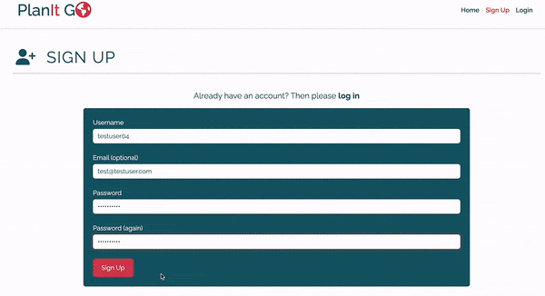

* When clicking on the 'Sign Up' link or call to action hero button, users are directed to the Sign Up page and if they complete a valid form, an account is created and they are successfully logged in.  They are redirected to their trip list page where they are prompted to create a profile.

<br>

| User Story | Satisfies Acceptance Criteria |
| ---- | :----: |
| As a Site User I can log in to my account so that I can create, view, update and delete my trips [#3](https://github.com/rkillickdev/plan-it-go/issues/3) | Pass |

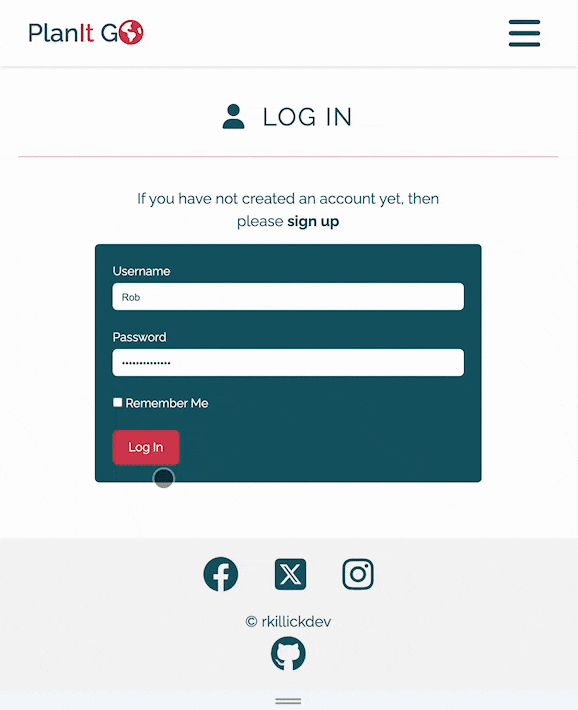

* When clicking on the "Login' link, users are directed to the Login page and if they complete a valid form, their account is retrieved and they are successfully logged in.  They are redirected to their trip list page.

<br>

| User Story | Satisfies Acceptance Criteria |
| ---- | :----: |
| As a Site User I can log out of my account for security so that no one else can access or modify my trips [#4](https://github.com/rkillickdev/plan-it-go/issues/4) | Pass |

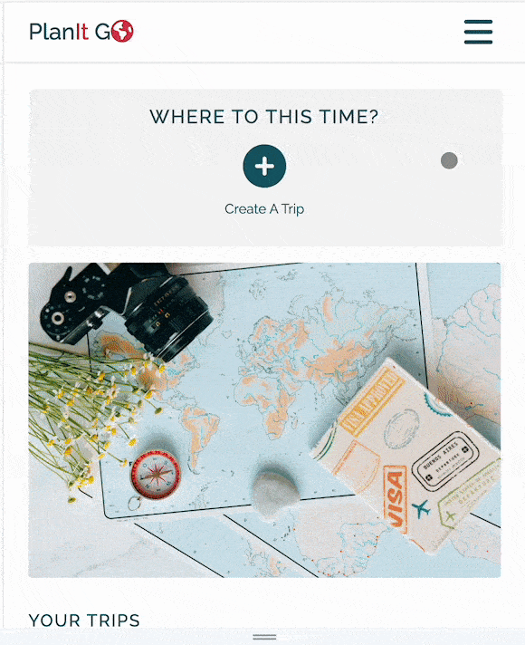

* When clicking on the "Logout' link, users are directed to the Logout confirmation page.  If they click on the 'Logout' button, they are successfully logged out and redirected to the home page.

<br>

| User Story | Satisfies Acceptance Criteria |
| ---- | :----: |
| As a Site User I am aware of my login status so I know whether I can carry out actions available only to logged in users [#5](https://github.com/rkillickdev/plan-it-go/issues/5) | Pass |

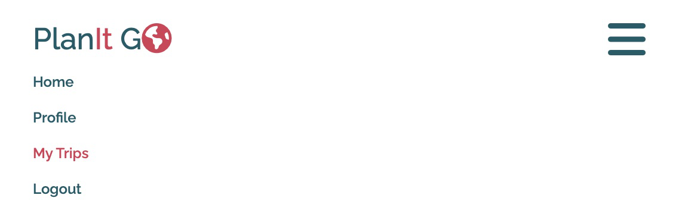

* Only authenticated users are able to see 'Profile' and 'My Trips' links in the navbar.  Also the toast messages that appear on successful sign up, login and logout provide feedback to the user about their status throughout their site experience.

<br>

| User Story | Satisfies Acceptance Criteria |
| ---- | :----: |
| As a Site User I can create and update a user profile for my account so that I can personalise my details with a screen name, image and bio [#6](https://github.com/rkillickdev/plan-it-go/issues/6) | Pass |

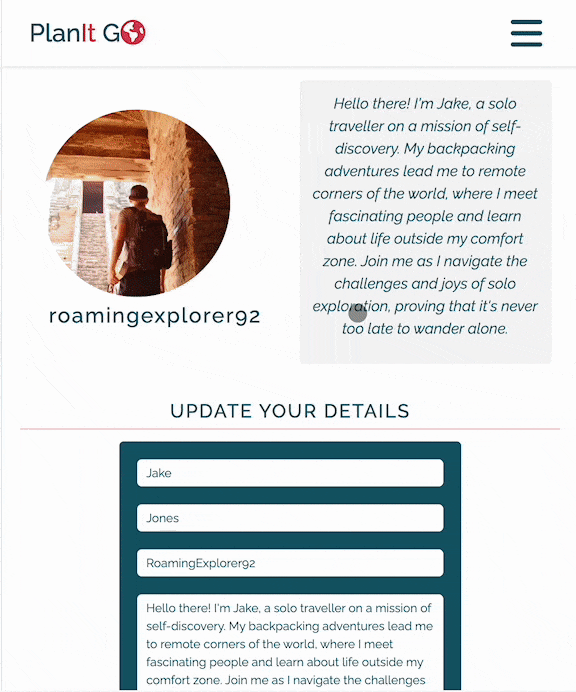

* Clicking on the 'Profile' link in the navbar directs the user to their profile, where they can modify details.  They are notified of successful updates with a toast message and redirected to their trip list page.

<br>

| User Story | Satisfies Acceptance Criteria |
| ---- | :----: |
| As a Site Administrator I can moderate user reviews so that I can decide whether the content and images are appropriate for other site users to view [#34](https://github.com/rkillickdev/plan-it-go/issues/34) | Pass |

* I have created a user called 'moderator' and given them permissions to access the Django Admin panel and update the boolean field 'approved' from False to True for instances of the Review and Image model.

<br>

| User Story | Satisfies Acceptance Criteria |
| ---- | :----: |
| As a Site Administrator I can access models from the Django admin panel so that I can interact directly with the database [#35](https://github.com/rkillickdev/plan-it-go/issues/35) | Pass |

* I have created a superuser who has access to the entirety of the Django Admin panel and a 'moderator' login, who has limited access to the Django Admin panel, based on the tasks they need to carry out.

<br>

| User Story | Satisfies Acceptance Criteria |
| ---- | :----: |
| As a user with staff status I can add and amend details for destinations so that the content on the site can continually be expanded and updated [#39](https://github.com/rkillickdev/plan-it-go/issues/39) | Pass |

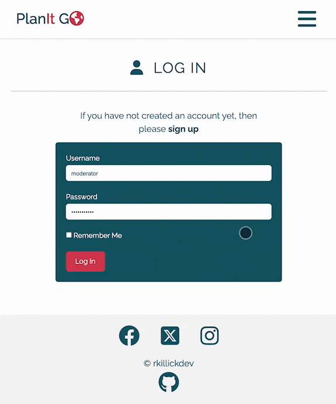

<br>

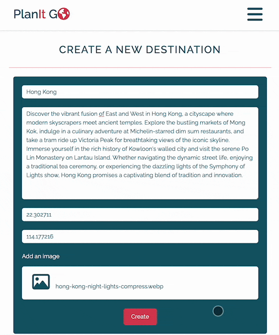

<br>

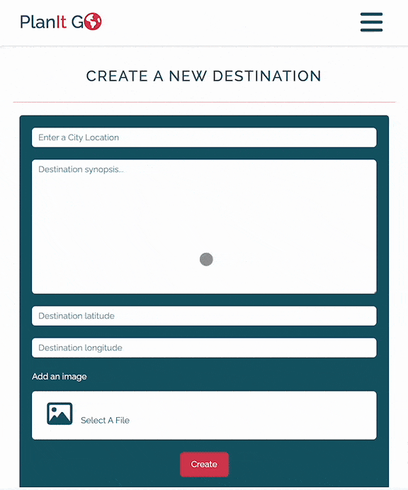

* I have created a user called 'moderator' and as a superuser, allocated them 'staff' status.  This mean that on successful login, they can access a 'destinations' page where they can create new destinations or update existing.  Once a new destination has been created, it will not be displayed to regular site users until it has been approved via the Django Admin Panel.  This prevents a situation where a destination might be available to browse but it has no places to display yet.

<br>

| User Story | Satisfies Acceptance Criteria |
| ---- | :----: |
| As a user with staff status I can add places for a destination to the database so that site users can browse these recommended places and add to their trips [#40](https://github.com/rkillickdev/plan-it-go/issues/40) | Pass |

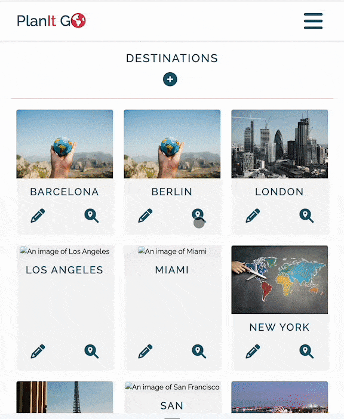

* If no places exist for the selected destination, clicking on the magnifying glass takes the staff user to a 'get places' page where they can attempt to retrieve places.  If a json file has been prepared in advance using the APIFY Trip Advisor web scraper tool, this is accessed and the database is populated with places for the specified destination.  The staff user is then redirected to the newly populated place list page.

<br>

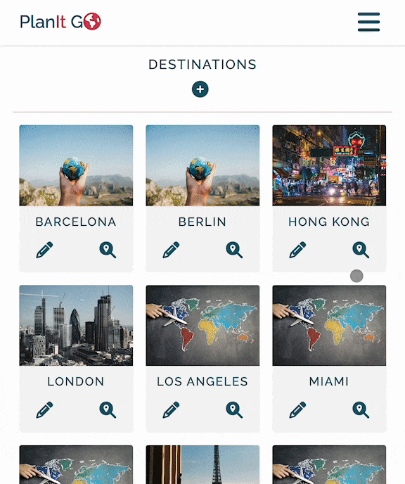

* If a json file is not yet available to the staff user, this scenario is handled gracefully by providing them feedback in the form of a toast message.

<br>

| User Story | Satisfies Acceptance Criteria |
| ---- | :----: |
| As an admin superuser I can customise the django admin panel so that I can order and filter instances of models [#42](https://github.com/rkillickdev/plan-it-go/issues/42) | Pass |

* This has been achieved by specifying the display and search fields in the admin.py file for required apps.  This provides an enhanced experience in the Django Admin Panel, especially when there are a large number of instances for a model.

<br>

| User Story | Satisfies Acceptance Criteria |
| ---- | :----: |
| As a staff user I can moderate places through the site interface so that I can ensure places with sufficient quality info are displayed to site users [#61](https://github.com/rkillickdev/plan-it-go/issues/61) | Pass |

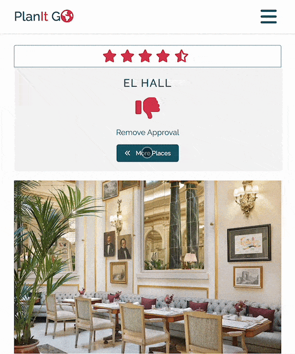

* Once places have been retrieved for a location, the moderator with staff user permissions can navigate to the detail page for each place and decide whether it is suitable to display to regular site users.  By default, places are approved but clicking on the thumbs down icon removes approval and this place will then not be displayed to regular site users.

<br>

### **EPIC: Plan Trip [#7](https://github.com/rkillickdev/plan-it-go/issues/7)**

| User Story | Satisfies Acceptance Criteria |
| ---- | :----: |
| As a Site User I can create a personalised trip planner for a chosen destination so that I can start planning places to visit on my trip [#8](https://github.com/rkillickdev/plan-it-go/issues/8) | Pass |


* Clicking on the 'Create a trip' + icon takes the user to a trip creation page, where they can submit their information in a form.  On success, the user is redirected to their trip detail page.

<br>

| User Story | Satisfies Acceptance Criteria |
| ---- | :----: |
| As a Site User I can view recommended activities for the chosen location so that I can plan a bespoke itinerary for the trip that appeals to my tastes and interests [#9](https://github.com/rkillickdev/plan-it-go/issues/9) | Pass |


* On the trip details page, a recommendations section is displayed to users, based on the selected destination of their trip.

<br>

| User Story | Satisfies Acceptance Criteria |
| ---- | :----: |
| As a Site User I can view details of a specific place so that I can decide whether I should add it to my itinerary [#10](https://github.com/rkillickdev/plan-it-go/issues/10) | Pass |

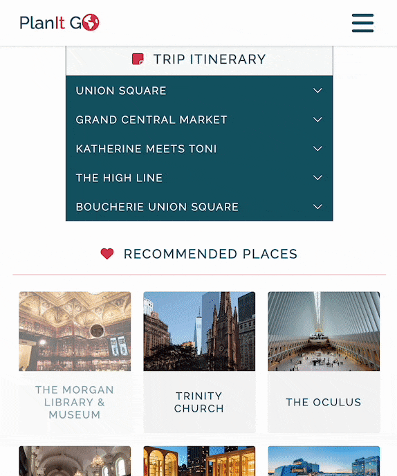

* Clicking on a recommended place or a place in the trip itinerary redirects the user to a details page for the selected place.

<br>

| User Story | Satisfies Acceptance Criteria |
| ---- | :----: |
| As a Site User I can add a recommendation to my trip planner so that I can build an itinerary to use and refer to when travelling to the location [#11](https://github.com/rkillickdev/plan-it-go/issues/11) | Pass |

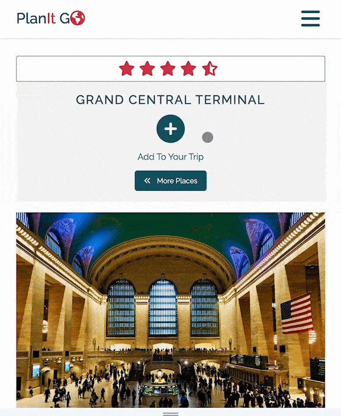

* When navigating to the details page of a place, site users can click on the 'Add To Your Trip' + icon.  This place then appears in the trip itinerary accordion on their trip detail page.

<br>

| User Story | Satisfies Acceptance Criteria |
| ---- | :----: |
| As a Site User I can remove places from my trip planner so that I can have control over building an itinerary and change my mind about places that were previously added [#12](https://github.com/rkillickdev/plan-it-go/issues/12) | Pass |

* When navigating to the details page of a place, site users can click on the 'Remove From Your Trip' - icon.  This place is then removed from the trip itinerary accordion on their trip detail page.  This functionality is more for users to be able to toggle between adding and removing while they remain on the place detail page.

<br>

| User Story | Satisfies Acceptance Criteria |
| ---- | :----: |
| As a Site User I can choose to view my current trip itinerary at any point during planning so that I can keep track of places I have added [#13](https://github.com/rkillickdev/plan-it-go/issues/13) | Pass |


* Clicking on the 'More Places' button returns the user to their trip detail page at any time.

<br>

| User Story | Satisfies Acceptance Criteria |
| ---- | :----: |
| As a Site User I can edit my trip itinerary by removing a place or adding more so that I can continue modifying my plans [#14](https://github.com/rkillickdev/plan-it-go/issues/14) | Pass |

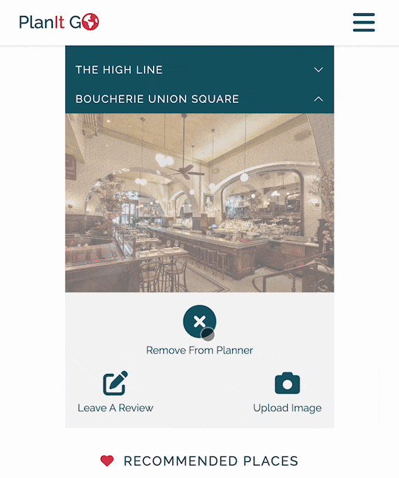

* Users are presented with an option for each place in their itinerary to 'Remove from planner'.  This action requires approval by confirming in a modal.  The place is then removed from the itinerary.

<br>

| User Story | Satisfies Acceptance Criteria |
| ---- | :----: |
| As a Site User I can save all the places in my trip itinerary so that I can return to my planning at any time [#15](https://github.com/rkillickdev/plan-it-go/issues/15) | Pass |

* It was not necessary to implement functionality for this user story, as trip instances are continually updated and saved to the database and can be accessed at any time by the user.

<br>

| User Story | Satisfies Acceptance Criteria |
| ---- | :----: |
| As a user I can see a countdown to my trip so that I know how many days until I travel [#36](https://github.com/rkillickdev/plan-it-go/issues/36) | N/A |

* This user story was not classified as a 'Must Have' for any of the agile sprints, so due to time constraints, it has been placed in a future features column of my [kanban board](https://github.com/users/rkillickdev/projects/4).  This feature can be implemented in a future iteration.

<br>

| User Story | Satisfies Acceptance Criteria |
| ---- | :----: |
| As a user I can filter recommended places so that I can build an itinerary tailored to my interests [#37](https://github.com/rkillickdev/plan-it-go/issues/37) | N/A |

* This user story was not classified as a 'Must Have' for any of the agile sprints, so due to time constraints, it has been placed in a future features column of my [kanban board](https://github.com/users/rkillickdev/projects/4).  This feature can be implemented in a future iteration.

<br>

| User Story | Satisfies Acceptance Criteria |
| ---- | :----: |
| As a user I can see places visually on a map so that I can see where they are and plan a route [#38](https://github.com/rkillickdev/plan-it-go/issues/38) | Pass |


* The location of each place is displayed on a map on the details page.

<br>

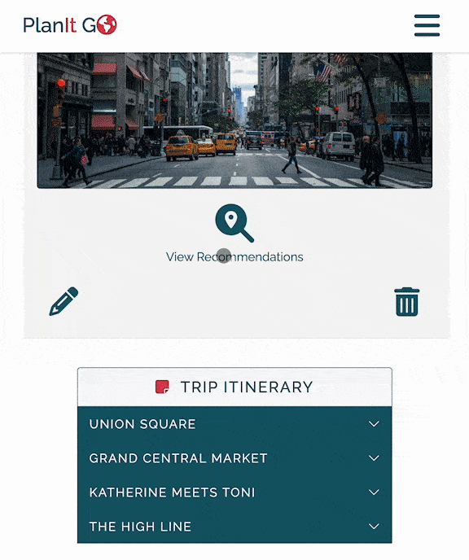

* On the trip detail page, as places are added to the itinerary, they are dynamically plotted on the map with markers.  When clicked, the marker displays the name of the place.

<br>

| User Story | Satisfies Acceptance Criteria |
| ---- | :----: |
| As a user I can view place ratings displayed as stars so that I can immediately understand the popularity of a place [#41](https://github.com/rkillickdev/plan-it-go/issues/41) | Pass |


* Each place displays stars based on the star rating value retrieved from the Place instance field 'rating'.

<br>

### **EPIC: Manage Trip [#16](https://github.com/rkillickdev/plan-it-go/issues/16)**

| User Story | Satisfies Acceptance Criteria |
| ---- | :----: |
| As a Site User I can view a summary of all upcoming and completed trips so that I can choose one to view or edit [#17](https://github.com/rkillickdev/plan-it-go/issues/17) | Pass |

* Site users can view this information from their trip list page.  This is where they land after logging in.  It is also always accessible to logged in users by clicking the 'My Trips' link in the nav bar.

<br>

| User Story | Satisfies Acceptance Criteria |
| ---- | :----: |
| As a Site User I can select a trip so that I can view or edit details of the itinerary [#18](https://github.com/rkillickdev/plan-it-go/issues/18) | Pass |

* Clicking on a trip card on the trip list page directs the user to the associated trip detail page, where they can view and edit details.

<br>

| User Story | Satisfies Acceptance Criteria |
| ---- | :----: |
| As a Site User I can mark places on a trip itinerary as completed so that I can keep track of places that I have visited while travelling [#19](https://github.com/rkillickdev/plan-it-go/issues/19) | N/A |

* This user story was not classified as a 'Must Have' for any of the agile sprints, so due to time constraints, it has been placed in a future features column of my [kanban board](https://github.com/users/rkillickdev/projects/4).  This feature can be implemented in a future iteration.

<br>

| User Story | Satisfies Acceptance Criteria |
| ---- | :----: |
| As a Site User I can delete an entire trip so that I have control of the trips that are stored in my user account [#20](https://github.com/rkillickdev/plan-it-go/issues/20) | Pass |

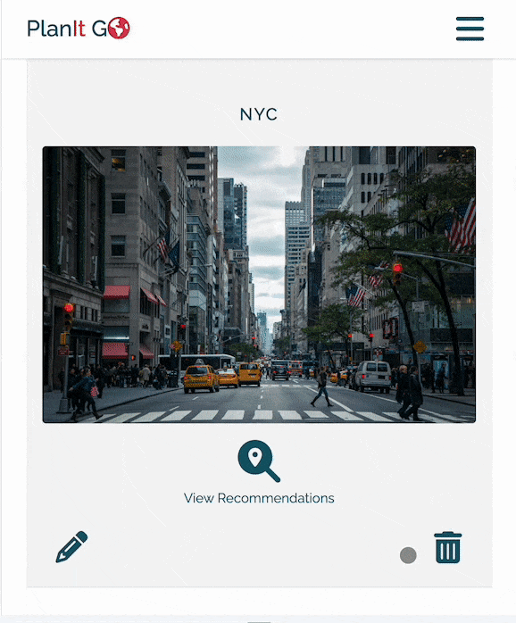

* Clicking on the trash can icon on the trip detail page actions this functionality.

<br>

### **EPIC: Review [#21](https://github.com/rkillickdev/plan-it-go/issues/21)**

| User Story | Satisfies Acceptance Criteria |
| ---- | :----: |
| As a Site User I can write a review of a place on my itinerary so that I can share my experiences of the visit with other site users [#22](https://github.com/rkillickdev/plan-it-go/issues/22) | Pass |

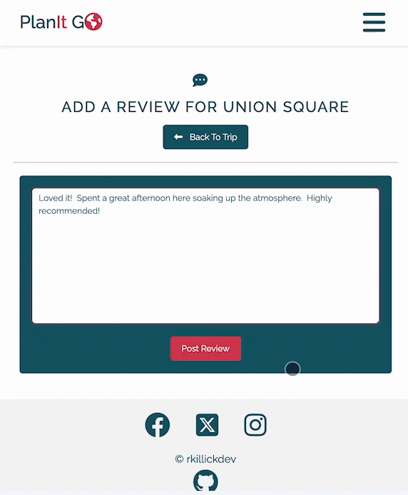

* Clicking on the 'Leave A Review' icon for a place in the trip itinerary redirects the user to the reviews page.  From here they can leave a review for the associated place.  Once submitted, the review will appear on their reviews page, but will not be available for other site users to read until it has been approved by the site moderator.

<br>

| User Story | Satisfies Acceptance Criteria |
| ---- | :----: |
| As a Site User I can edit my review so that I can update the content or correct grammatical errors [#23](https://github.com/rkillickdev/plan-it-go/issues/23) | Pass |

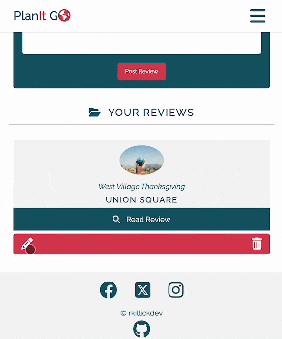

* Clicking on the pencil icon of a review card populates the review form with the associated review text. Clicking on the form 'update' button updates this instance of review in the database and resets the 'approved' field to False.

<br>

| User Story | Satisfies Acceptance Criteria |
| ---- | :----: |
| As a Site User I can delete my review so that I can have control of reviews if I decide they are no longer relevant or necessary [#24](https://github.com/rkillickdev/plan-it-go/issues/24) | Pass |

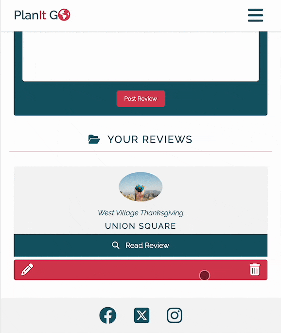

* Clicking on the trash can icon of a review card opens a delete confirm modal to check the user really wants to delete.  Confirming the action deletes this instance of review from the database.

<br>

| User Story | Satisfies Acceptance Criteria |
| ---- | :----: |
| As a Site User I can decide whether I would recommend a place so that I can help other site users to make decisions when planning places to visit on their trip [#25](https://github.com/rkillickdev/plan-it-go/issues/25) | N/A |

* This user story was not classified as a 'Must Have' for any of the agile sprints, so due to time constraints, it has been placed in a future features column of my [kanban board](https://github.com/users/rkillickdev/projects/4).  This feature can be implemented in a future iteration.

<br>

| User Story | Satisfies Acceptance Criteria |
| ---- | :----: |
| As a Site User I can upload images for a place on my itinerary so that I can store the memories from my trip and share these experiences with other site users [#26](https://github.com/rkillickdev/plan-it-go/issues/26) | Pass |

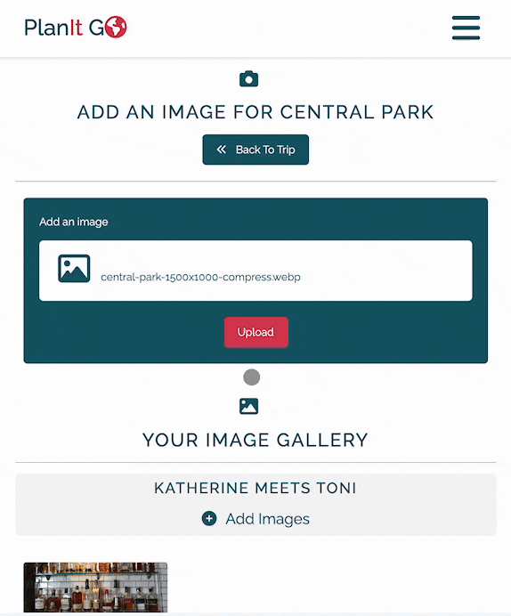

* Users can upload an image for a place by selecting a file and clicking 'Upload'.

<br>


* If the size of the file selected is above 2 MB, the user is warned and asked to select a smaller image.  This is to prevent a long delay in the page loading as the file uploads to Cloudinary.

<br>

| User Story | Satisfies Acceptance Criteria |
| ---- | :----: |
| As a Site User I can delete images that I have uploaded for a place so that I can have control over which images are viewable [#27](https://github.com/rkillickdev/plan-it-go/issues/27) | Pass |

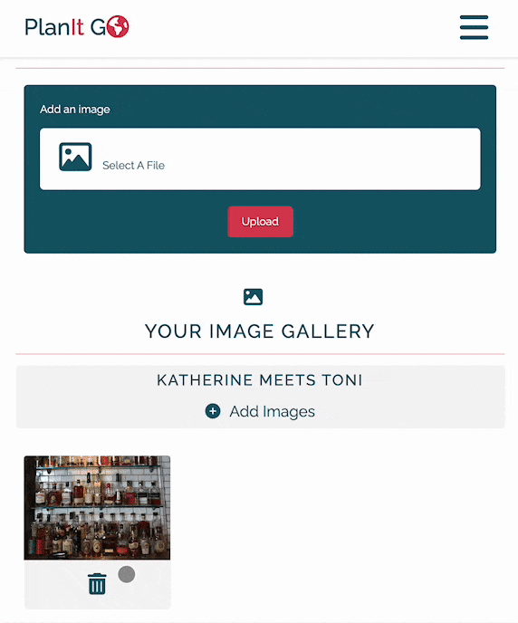

* Clicking on the trash can icon underneath an image in the gallery opens a delete confirm modal to check the user really wants to delete.  Confirming the action deletes this instance of image from the database.

<br>

### **EPIC: User Experience [#28](https://github.com/rkillickdev/plan-it-go/issues/28)**

| User Story | Satisfies Acceptance Criteria |
| ---- | :----: |
| As a Site User I can immediately understand the purpose of the site when I arrive at the home page so that I can quickly and intuitively start planning trips [#29](https://github.com/rkillickdev/plan-it-go/issues/29) | Pass |

* The hero image used on the home page instantly conveys the idea of plotting out places on a map, which ties into the core goal of the site which is to assist users in planning trips to destinations around the world.  The call to action button makes it quick and easy for the user to sign up and login, so they can start using the advanced functionality of the site

<br>

| User Story | Satisfies Acceptance Criteria |
| ---- | :----: |
| As a Site User I can intuitively navigate the site so that I can view the content I require with minimal steps [#30](https://github.com/rkillickdev/plan-it-go/issues/30) | Pass |

* Navigation has been made intuitive by the use of a nav bar that users will find familiar.  The hover effect applied to links indicate that clicking will take them to a new page.  Navigation is similarly intuitive on smaller devices with the immediately recognisable hamburger toggler indicating how users can expand the nav links.

<br>

| User Story | Satisfies Acceptance Criteria |
| ---- | :----: |
| As a Site User I can view site content simply and intuitively so that I can easily gather the information I need [#31](https://github.com/rkillickdev/plan-it-go/issues/31) | Pass |

* Use of components such as the Bootstrap accordion, tabbed pages and carousels have provided solutions for storing and displaying content, without the need for the user to navigate between too many pages.  They can normally access the information they are looking for in a couple of clicks.

<br>

| User Story | Satisfies Acceptance Criteria |
| ---- | :----: |
| As a Site User I feel a positive emotional response while interacting with the site so I am engaged and continue to use and return [#32](https://github.com/rkillickdev/plan-it-go/issues/32) | Pass |

* Continuity of styling, imagery and functionality across the site means that each page has a familiar feel when the user lands on it.  Static images used on the site have been selected to invoke a curiosity about travel and the desire to find out more about destinations around the world.  Even if errors occur, they are handled gracefully in keeping with the site aesthetics, so users are not taken away from this positive experience.  User Interactions with the functionality of the site are designed to be simple and intuitive and provide a pleasing user experience.

<br>

| User Story | Satisfies Acceptance Criteria |
| ---- | :----: |
| As a Site User I can view the site on a range of screen sizes so that I can enjoy good user experience on my device of choice [#33](https://github.com/rkillickdev/plan-it-go/issues/33) | Pass |

* Information and site content remains easy to access and uncluttered, even on smaller mobile devices.  Use of Bootstrap breakpoints and media queries has ensured the site is responsive across a range of screen sizes.

<br>

| User Story | Satisfies Acceptance Criteria |
| ---- | :----: |
| As a user I can access links to social media accounts related to the site so that I can find out more about the site and its developer [#46](https://github.com/rkillickdev/plan-it-go/issues/46) | Pass |


* The site footer which is displayed on every page provides access to all social media links.

<br>

[Back to top &uarr;](#contents)

## **Full Testing**

### **Homepage**

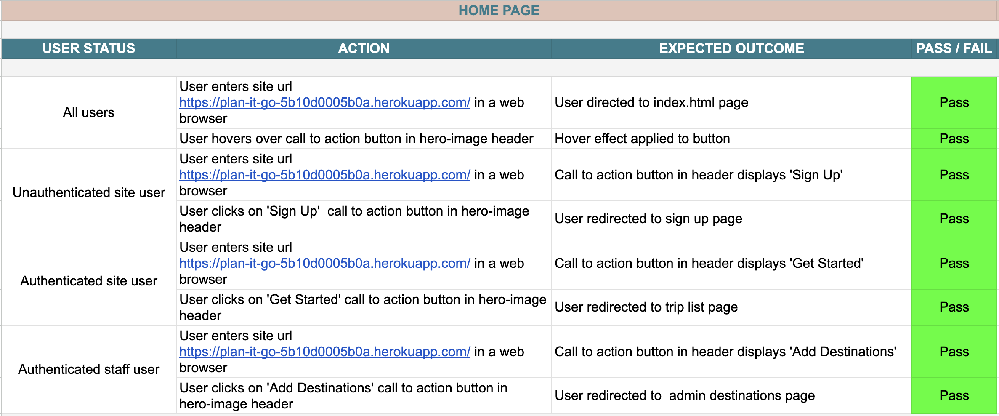
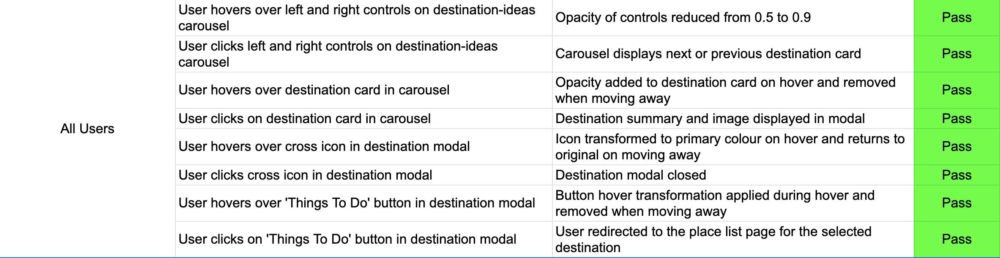

### **Navbar**

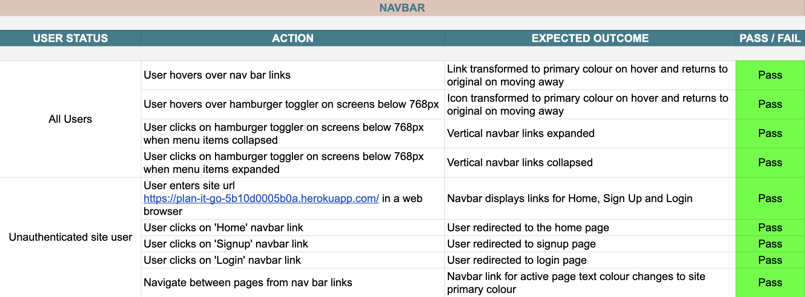
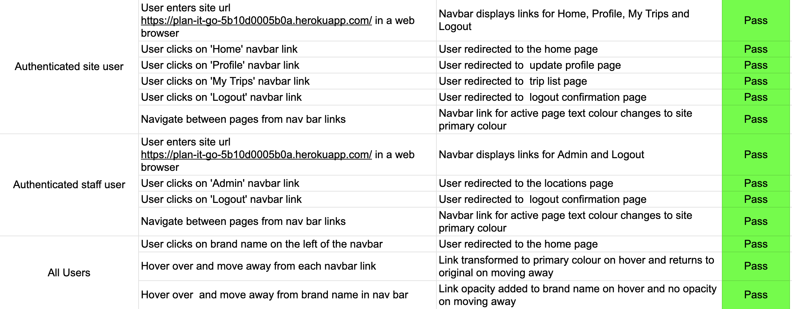

### **Footer**

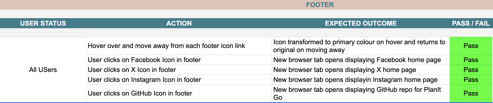

### **AllAuth**

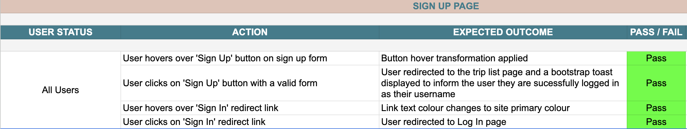
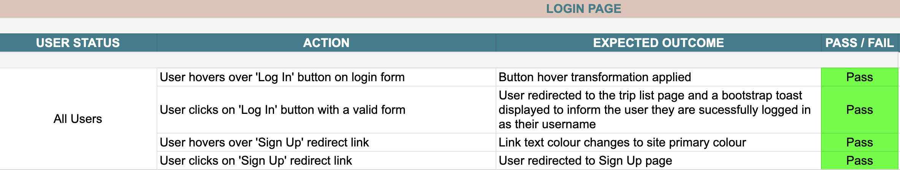

### **Trip List**

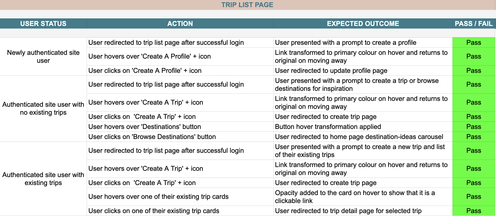

### **Profile Page**

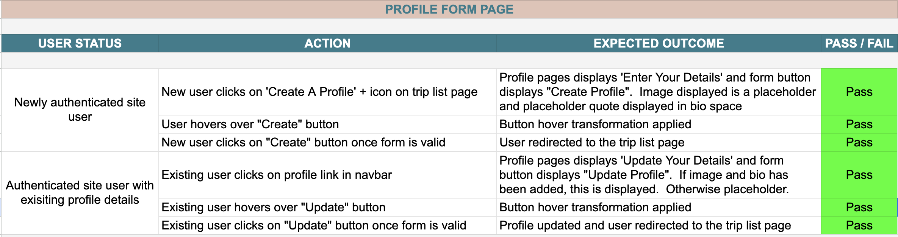

### **Create Trip Page**

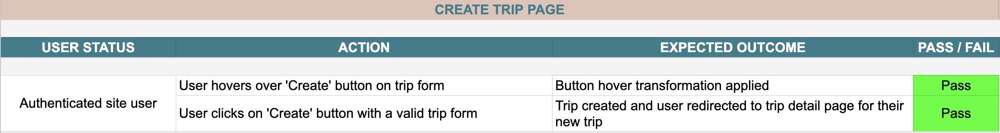

### **Trip Detail Page**

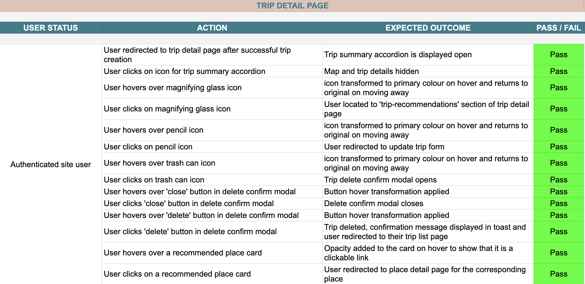
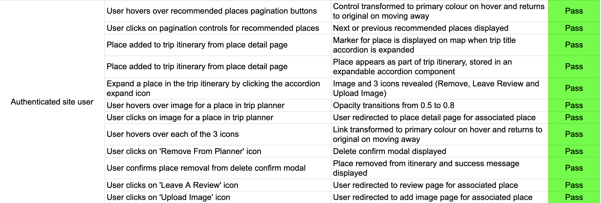

### **Place Detail Page**

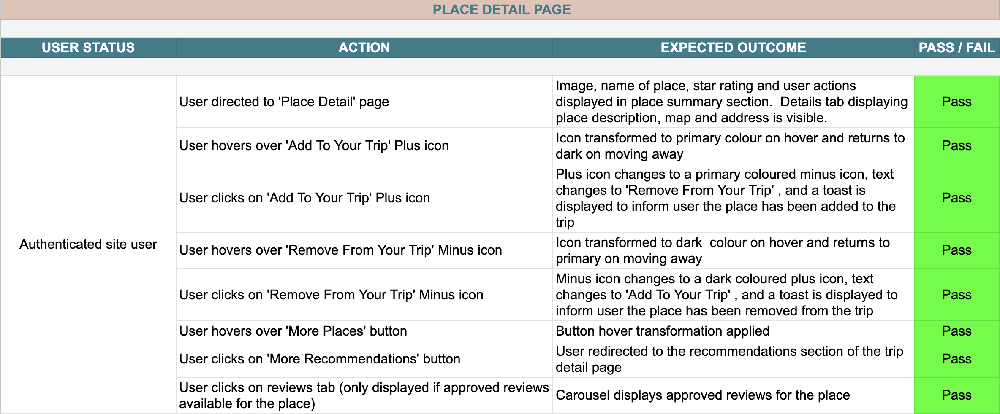


### **Review Page**

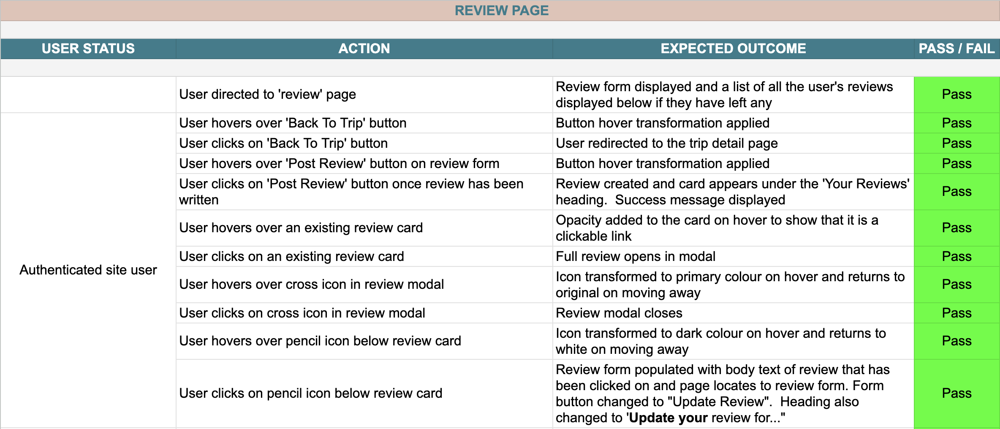
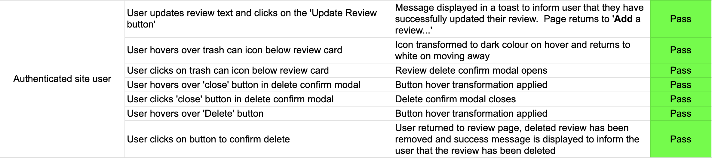

### **Add Image Page**

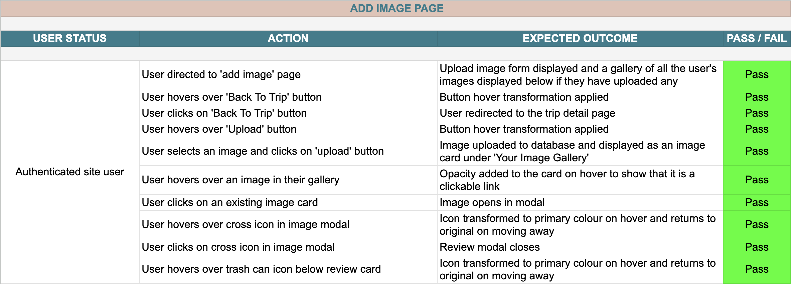
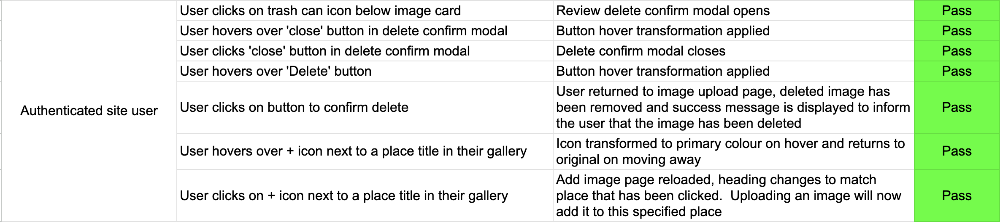

### **Place List Page**

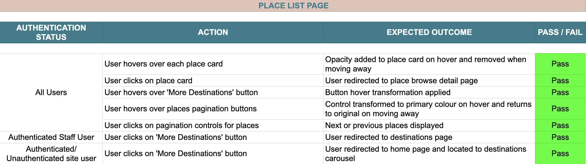

### **Browse Detail Page**

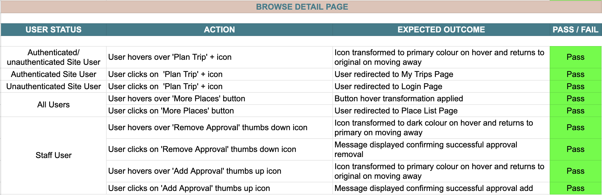

### **Destinations Page (Staff Only)**

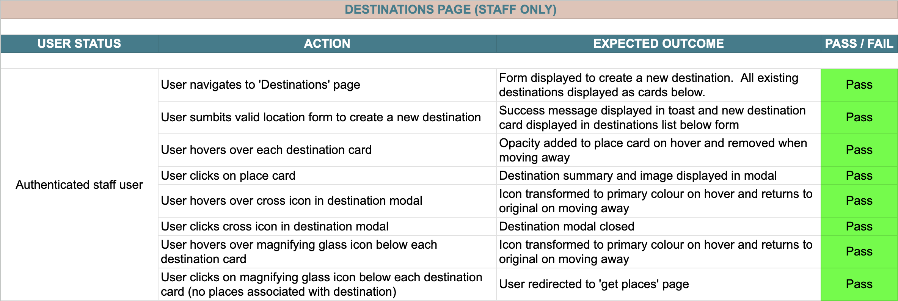
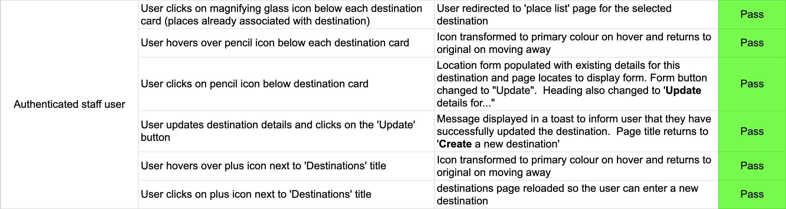

### **Get Places Page (Staff Only)**

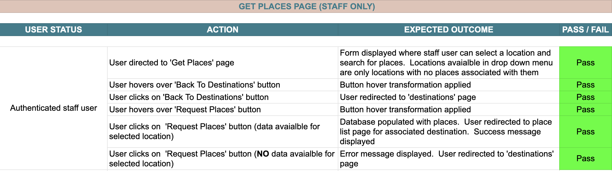

## **Defensive Testing**

I have carried out a range of tests to check that any defensive programming implemented in the code is operating as expected.  These tests confirm that site users cannot access pages without the correct permission to do so, even if they enter valid urls.

### **User Status: Not logged in**

| URL Tested | Expected Outcome | Pass/Fail |
| ---- | ---- | ---- |
| https://plan-it-go-5b10d0005b0a.herokuapp.com/profiles/update_profile/6 | User directed to login page | Pass |
| https://plan-it-go-5b10d0005b0a.herokuapp.com/trips/update_trip/manhattan-2023/6 | User directed to login page | Pass |
| https://plan-it-go-5b10d0005b0a.herokuapp.com/trips/manhattan-2023/delete_trip/6 | User directed to login page | Pass |
| https://plan-it-go-5b10d0005b0a.herokuapp.com/trips/manhattan-2023/6 | User directed to login page | Pass |
| https://plan-it-go-5b10d0005b0a.herokuapp.com/trips/manhattan-2023/6/place/19/ | User directed to login page | Pass |
| https://plan-it-go-5b10d0005b0a.herokuapp.com/trips/manhattan-2023/6/review/19/ | User directed to login page | Pass |
| https://plan-it-go-5b10d0005b0a.herokuapp.com/trips/manhattan-2023/6/review/19/edit_review/5 | User directed to login page | Pass |
| https://plan-it-go-5b10d0005b0a.herokuapp.com/trips/manhattan-2023/6/review/19/delete_review/5 | User directed to login page | Pass |
| https://plan-it-go-5b10d0005b0a.herokuapp.com/trips/manhattan-2023/6/images/19/ | User directed to login page | Pass |
| https://plan-it-go-5b10d0005b0a.herokuapp.com/trips/manhattan-2023/6/images/19/delete_image/3 | User directed to login page | Pass |
| https://plan-it-go-5b10d0005b0a.herokuapp.com/locations/ | User directed to login page | Pass |
| https://plan-it-go-5b10d0005b0a.herokuapp.com/places/get_places/3/london | User directed to Django Admin Login page | Pass |

### **User Status: Logged in attempting to access unauthorised urls**

| URL Tested | Expected Outcome | Pass/Fail |
| ---- | ---- | ---- |
| https://plan-it-go-5b10d0005b0a.herokuapp.com/profiles/update_profile/6 | 403 permission denied template displayed | Pass |
| https://plan-it-go-5b10d0005b0a.herokuapp.com/trips/update_trip/manhattan-2023/6 | 403 permission denied template displayed | Pass |
| https://plan-it-go-5b10d0005b0a.herokuapp.com/trips/manhattan-2023/delete_trip/6 | 403 permission denied template displayed | Pass |
| https://plan-it-go-5b10d0005b0a.herokuapp.com/trips/manhattan-2023/6 | 403 permission denied template displayed | Pass |
| https://plan-it-go-5b10d0005b0a.herokuapp.com/trips/manhattan-2023/6/place/19/ | 403 permission denied template displayed | Pass |
| https://plan-it-go-5b10d0005b0a.herokuapp.com/trips/manhattan-2023/6/review/19/ | 403 permission denied template displayed | Pass |
| https://plan-it-go-5b10d0005b0a.herokuapp.com/trips/manhattan-2023/6/review/19/edit_review/5 | 403 permission denied template displayed | Pass |
| https://plan-it-go-5b10d0005b0a.herokuapp.com/trips/manhattan-2023/6/review/19/delete_review/5 | 403 permission denied template displayed | Pass |
| https://plan-it-go-5b10d0005b0a.herokuapp.com/trips/manhattan-2023/6/images/19/ | 403 permission denied template displayed | Pass |
| https://plan-it-go-5b10d0005b0a.herokuapp.com/trips/manhattan-2023/6/images/19/delete_image/3 | 403 permission denied template displayed | Pass |
| https://plan-it-go-5b10d0005b0a.herokuapp.com/locations/ | User directed to Django Admin Login page | Pass |
| https://plan-it-go-5b10d0005b0a.herokuapp.com/places/get_places/3/london | User directed to Django Admin Login page | Pass |

## **Form Testing**

All forms have been checked thoroughly to ensure they cannot be submitted until all fields are valid.

**Location Form**

| Field | Action | Expected Outcome | Pass/Fail |
| ---- | ---- | ---- | ---- |
| city | Input > 50 characters | Form prevents input of any additional characters | Pass |
| city | Input empty | Form displays warning 'Please fill in this field' | Pass |
| summary | Input empty | Form displays warning 'Please fill in this field' | Pass |
| latitude | Input empty | Form displays warning 'Please fill in this field' | Pass |
| latitude | Input digits > 10 | Form displays warning 'Ensure that there are no more than 10 digits in total' | Pass |
| latitude | Input 10 digits with no decimal place | Form displays warning 'Ensure that there are no more than 2 digits before the decimal point' | Pass |
| latitude | Input 1.234567891 | Form displays warning 'Ensure that there are no more than 8 decimal places' | Pass |
| latitude | Input .1234567891 | Form displays warning 'Ensure that there are no more than 8 decimal places' | Pass |
| latitude | Input letters and characters | Form displays warning 'Enter a number' | Pass |
| longitude | Input empty | Form displays warning 'Please fill in this field' | Pass |
| longitude | Input digits > 11 | Form displays warning 'Ensure that there are no more than 11 digits in total' | Pass |
| longitude | Input 11 digits with no decimal place | Form displays warning 'Ensure that there are no more than 3 digits before the decimal point' | Pass |
| longitude | Input 1.2345678912 | Form displays warning 'Ensure that there are no more than 8 decimal places' | Pass |
| longitude | Input 12.345678912 | Form displays warning 'Ensure that there are no more than 8 decimal places' | Pass |
| longitude | Input .12345678912 | Form displays warning 'Ensure that there are no more than 8 decimal places' | Pass |
| longitude | Input letters and characters | Form displays warning 'Enter a number' | Pass |
| image | Select file larger than 2 MB | File size warning modal displayed | Pass |

<br>

**Trip Form**

| Field | Action | Expected Outcome | Pass/Fail |
| ---- | ---- | ---- | ---- |
| location | Input empty | Form displays warning 'Please fill in this field' | Pass |
| title | Input empty | Form displays warning 'Please fill in this field' | Pass |
| title | Input > 30 characters | Form prevents input of any additional characters | Pass |
| trip_image | Select file larger than 2 MB | File size warning modal displayed | Pass |

<br>

**Profile Form**

| Field | Action | Expected Outcome | Pass/Fail |
| ---- | ---- | ---- | ---- |
| first_name | Input empty | Form displays warning 'Please fill in this field' | Pass |
| first_name | Input > 50 characters | Form prevents input of any additional characters | Pass |
| surname | Input empty | Form displays warning 'Please fill in this field' | Pass |
| surname | Input > 50 characters | Form prevents input of any additional characters | Pass |
| screen_name | Input empty | Form displays warning 'Please fill in this field' | Pass |
| screen_name | Input > 25 characters | Form prevents input of any additional characters | Pass |
| screen_name | Input screen_name that already exists in database | Form displays warning 'Profile with this screen name already exists' | Pass |
| profile_image | Select file larger than 2 MB | File size warning modal displayed | Pass |

<br>

**Review Form**

| Field | Action | Expected Outcome | Pass/Fail |
| ---- | ---- | ---- | ---- |
| body | Input empty | Form displays warning 'Please fill in this field' | Pass |

<br>

**Image Form**

| Field | Action | Expected Outcome | Pass/Fail |
| ---- | ---- | ---- | ---- |
| place | Select file larger than 2 MB | File size warning modal displayed | Pass |

<br>

While testing forms I noticed that validation error messages generated by Django/ crispy forms displayed were not easy to read on the dark background of the form.  When I ran Wave on this, it threw a contrast error.  I have therefore decided to display the error message in white to ensure acceptable contrast colour ratio.  There may be a better solution to investigate in the long term, which could make the message even more obvious to the user.  The Exclaimation mark is still displayed in pink as this shows up against the white background of the form input, so this helps to communicate that an error has occured.

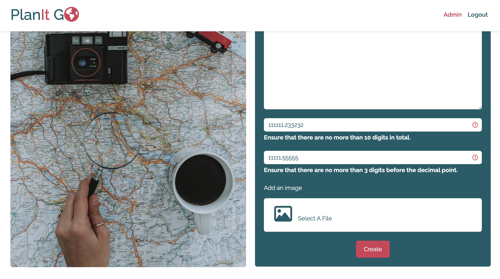

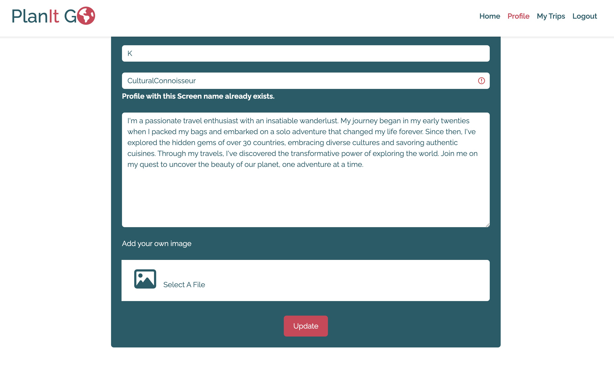

## **Javascript Testing**

I have manually tested the javascript used throughout the site and no errors are logged in the console.  There is an 'issue' logged on pages where google maps is loaded as shown below:

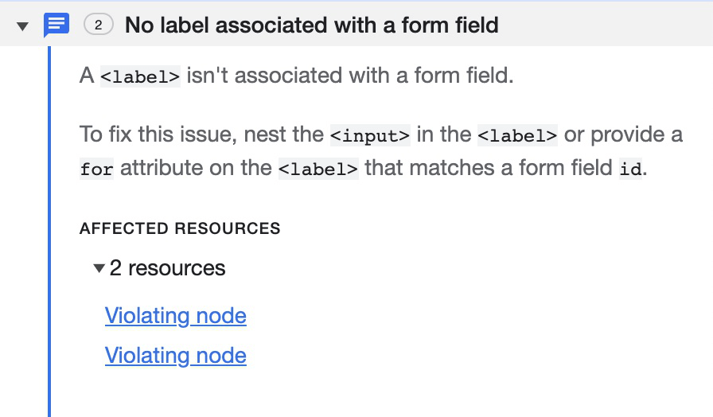

When I investigated the 'violating node', it is related to labels created by Google maps.  I mentioned this to my mentor and decided that this should not be addressed as it is caused by the rendering of the map.

<br>

| File | Action | Expected Outcome | Pass/Fail |
| ---- | ---- | ---- | ---- |
| static/js/delete-confirm-modals.js | Click on a trash can icon | Delete confirm modal opens and href for delete button populated with correct url to delete selected trip/ review /image.  Clicking delete confirms and triggers the correct Django view | Pass | 
| static/js/delete-confirm-modals.js | Click on Remove From Planner icon for a place in an itinerary | Delete confirm modal opens and action for delete button populated with correct url to trigger the remove_place view in Django | Pass |
| static/file-upload.js | Attempt to upload an image that is larger than 2 MB in size | Warning modal displayed asking the user to select a smaller file | Pass |
| static/js/forms.js | Navigate to a page that displays a form to create a trip / review / location | Submit button on form displayed as "Create" | Pass |
| static/js/forms.js | Navigate to a page that displays a form to update a trip / review / location | Submit button on form displayed as "Update" | Pass |
| static/js/hero-text-replace.js | Navigate to Home page | Text overlaying hero image rotates between displaying 'Plans' / "Memories' / 'It Happen' | Pass |
| static/js/img-src-backups.js | Navigate to a page where the src for an image is served from an external site and an error is returned | Placeholder url injected into src for the image with a broken link | CHECK |
| static/js/map-cluster.js | Navigate to trip detail page | Google Map for the specified trip location displayed with markers identifying each place that has been added to the trip itinerary | Pass |
| static/js/maps.js | Navigate to place detail or browse detail page | Google Map for the specified place displayed with a marker to pinpoint the exact location | Pass |
| static/js/reviews.js | Click pencil icon under a review card to edit review | Text area of form populated with review content. Submit button changed to display 'Update'. Review form action attribute injected with correct url to trigger the review_edit view for the selected review | Pass |
| static/js/solo-display-modals.js | Click a destination / review / image clickable card | Modal opens displaying full destination description/ full review body text / full image | Pass |
| static/js/star-rating.js | Navigate to place detail or browse detail page | Rating for selected place displayed using font awesome full, half and empty stars to accurately visualise the correct rating | Pass |
| static/js/toasts.js | Carry out actions that prompt user feed back (e.g. Create trip, remove place from planner, delete review) | Confirmation message displays in bootstrap toast and dissapears after a few seconds | Pass |

# **Automated Testing**

## **Unit Testing**

Alongside comprehensive manual testing, I have started the process of automated testing across the site using Python's unittest unit testing framework.  All tests written so far are passing and the aim will be to continue writing tests to eventually achieve 100% coverage across the site.

<details><summary>Test Runs</summary>

<br>

home/test_views.py

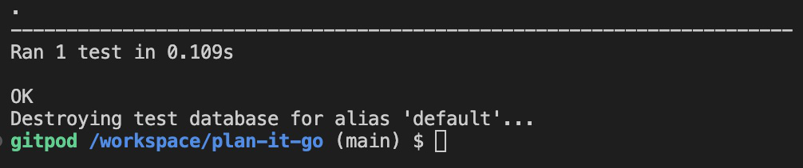

locations/test_views.py

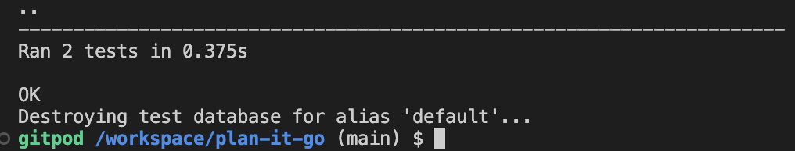

places/test_views.py

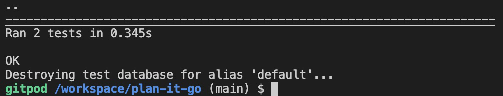

profiles/test_forms.py

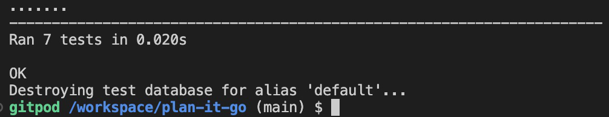

profiles/test_models.py


trips/test_models.py


trips/test_views.py


</details>

<br>

<details><summary>Test Coverage</summary>

<br>


</details>

## **Validators**

### **PEP8 Validation:**

<br>

I passed all python files through the [Code Institute Python Linter](https://pep8ci.herokuapp.com/) and no errors are found. Results of this tesing can be seen below:

<br>

App: planitgo

| File | Errors | Result |
| :----: | :-------: | :------: |
| asgi.py | 0 | Passed |
| settings.py | 0 | Passed |
| urls.py | 0 | Passed |
| wsgi.py | 0 | Passed |

App: home

| File | Errors | Result |
| :----: | :-------: | :------: |
| admin.py | 0 | Passed |
| apps.py | 0 | Passed |
| models.py | 0 | Passed |
| tests.py | 0 | Passed |
| urls.py | 0 | Passed |
| views.py | 0 | Passed |

App: locations

| File | Errors | Result |
| :----: | :-------: | :------: |
| admin.py | 0 | Passed |
| apps.py | 0 | Passed |
| forms.py | 0 | Passed |
| models.py | 0 | Passed |
| test_views.py | 0 | Passed |
| urls.py | 0 | Passed |
| views.py | 0 | Passed |

App: places

| File | Errors | Result |
| :----: | :-------: | :------: |
| admin.py | 0 | Passed |
| apps.py | 0 | Passed |
| forms.py | 0 | Passed |
| models.py | 0 | Passed |
| test_views.py | 0 | Passed |
| urls.py | 0 | Passed |
| views.py | 0 | Passed |

App: profiles

| File | Errors | Result |
| :----: | :-------: | :------: |
| admin.py | 0 | Passed |
| apps.py | 0 | Passed |
| forms.py | 0 | Passed |
| models.py | 0 | Passed |
| test_models.py | 0 | Passed |
| test_views.py | 0 | Passed |
| urls.py | 0 | Passed |
| views.py | 0 | Passed |

App: trips

| File | Errors | Result |
| :----: | :-------: | :------: |
| admin.py | 0 | Passed |
| apps.py | 0 | Passed |
| forms.py | 0 | Passed |
| models.py | 0 | Passed |
| test_models.py | 0 | Passed |
| test_views.py | 0 | Passed |
| urls.py | 0 | Passed |
| views.py | 0 | Passed |

Main Directory:

| File | Errors | Result |
| :----: | :-------: | :------: |
| env.py | 0 | Passed |
| manage.py | 0 | Passed |

### **JSHint Javascript Validation**

I passed my JavaScript files through the linter [JSHint](https://jshint.com/) to validate and check for any syntax errors.  Reports for each file can be viewd below.  Some warnings were returned in the two files relating to Google Maps.  This is not javascript that I have written, but sourced from the Google documentation about implementing Maps, markers and clusters.  I have therefore not addressed these warnings as the functionality of the maps is operating as expected.

The hero-text-replace.js file notes one undeclared variable and one unused variable.  This is code I sourced from the [ReplaceMe.js](https://adrianklimek.github.io/replaceme/#:~:text=About-,ReplaceMe.,can%20be%20used%20with%20jQuery.) documentation so I have not addressed this warning, as this feature is functioning as expected.

The toasts.js file notes one undefined variable but this is needed to implement this feature, so I have not addressed the warning.

The only other warnings raised for my own javascript were in solo-display-modals.js, delete-confirm-modals.js and reviews.js.  The warning was as follows:

```
Functions declared within loops referencing an outer scoped variable may lead to confusing semantics.
```

I fixed these by moving theouter scoped variables inside the function.  These js files are now clear of warnings.

<details><summary>JSHint Reports</summary>

<br>

**delete-confirm-modal**


**file-upload**


**forms**


**hero-text-replace**


**img-src-backup**


**map-cluster**


**maps**


**reviews**


**solo-display-modal**


**star-rating**


**toasts**


</details>

### **W3C HTML Markup Validator**

All pages have been run through the [W3C](https://validator.w3.org/).  Initially a couple of recurring errors appeared in various templates.  These are outlined below and have now been resolved:

• Custom attributes had been used throughout, but I had not prepended these with [**data-**](https://www.geeksforgeeks.org/what-are-custom-attributes-in-html5/).  These attributes have now been corrected.

• The following error appeared when trying to trigger the review modal by wrapping the review cards in a button: <br>
```Error: Element div not allowed as child of element button in this context. (Suppressing further errors from this subtree.)``` <br>
I solved this error by triggering the modal from a div, with a role attribute "button" and an aria label for accessibility.

It was not possible to copy and paste the html templates into the validator, due to the Django templating language being used.   Pages that can be accessed without user authentication were validated using the direct url.  However, any pages that require user login cannot be validated using the URL.  Instead, I visited each page as an authenticated user and retrieved the html code by right clicking and selecting *View Page Source*.  I then selected Validate by Direct Input on the W3C validator and pasted this raw HTML.

| Page | Errors | Warnings| Result |
| ---- | -------| --------| ------ |
| [Index.html](docs/testing/validation/html/index_html.png) | 0 | 0 | Passed |
| [place_list.html](docs/testing/validation/html/place_list_html.png) | 0 | 0 | Passed |
| [browse_detail.html](docs/testing/validation/html/browse_detail_html.png) | 0 | 0 | Passed |
| [login.html](docs/testing/validation/html/login_html.png) | 0 | 0 | Passed |
| [signup.html](docs/testing/validation/html/sign_up_html.png) | 0 | 0 | Passed |
| [trip_list.html](docs/testing/validation/html/trip_list_html.png) | 0 | 0 | Passed |
| [create_trip.html](docs/testing/validation/html/create_trip_html.png) | 0 | 1 | Passed |
| [profile_form.html](docs/testing/validation/html/profile_form_html.png) | 0 | 1 | Passed |
| [trip_detail.html](docs/testing/validation/html/trip_detail_html.png) | 0 | 0 | Passed |
| [place_detail.html](docs/testing/validation/html/place_detail_html.png) | 0 | 0 | Passed |
| [review.html](docs/testing/validation/html/review_html.png) | 0 | 0 | Passed |
| [add_image.html](docs/testing/validation/html/add_image_html.png) | 0 | 1 | Passed |
| [logout.html](docs/testing/validation/html/logout_html.png) | 0 | 0 | Passed |
| [destinations.html](docs/testing/validation/html/destinations_html.png) | 0 | 1 | Passed |
| [get_places.html](docs/testing/validation/html/get_places_html.png) | 0 | 0 | Passed |

• There was a warning that appeared on any page that contains a form with an upload image field.  I confirmed with my mentor that no action was required for this:

```
Warning: The type: attribute is unnecessary for JavaScript resources.
```

### **W3C CSS Validator**

I used the [W3C jigsaw](https://jigsaw.w3.org/css-validator/) CSS Validation Service to validate my CSS stylesheet.

| File | Errors | Result |
| ---- | :------: | :------: |
| static/css/styles.css | 0 | Pass |


The only warnings that occur are related to the use of bootstrap variables and vendor extensions.  I am satisfied that these are not causing any issues with the functionality of the site.


# **Performace**

## **Lighthouse**

### Improvements

I used Lighthouse within Google Chrome developer tools as a way of testing performance, accessibility, best practices and SEO of the site.  On initial testing, there were several improvement possibilities flagged which I implemented.  On doing so, accessibility, best practices and SEO scores are now at **100** across the site.  The improvements I made are listed below:

* Some links that were only represented as font awesome icons did not have discernible names.  This was also the case for some stretched links.  I added aria labels to these to improve accessibility.
* Ensured all heading elements appear in a sequentially descending order.
* I added ```aria-hidden="true"``` to carousel button controls and followed the bootstrap documentation to make the carousel accessible.
* I was initially triggering modals using an anchor link, but ligthouse alerted me to the fact that these links were [not crawlable](https://developers.google.com/search/docs/crawling-indexing/links-crawlable?visit_id=638351626897775578-1280043289&rd=1). I resolved this by using a button elelment to trigger these modal instead.

### Opportunities

Several opportunities were flagged by the lighthouse report to improve performance which was particularly when resting for mobile:

* ```Eliminate render-blocking resources```<br>
The main offender here was the bootstrap css file. I have attempted to improve load times by only importing bootstrap components that are being used into my scss file before compiling to css.  I have also minified the compiled css to reduce file size and results have improved

*```Properly size images / serve images in next-gen formats```<br>
The images referred to here are served by the trip advisor cdn, so I have not been able to alter the size or format of these files.  Having tested the site on various devices and networks, the issue does not seem to be impacting page load times to the detriment of the user.


<details><summary>Desktop Results</summary>

<br>

**Home Page**


**Place List**


**Browse Detail unauthenticated**


**Login**


**Signup**


**Trip List**


**Profile Form**


**Create Trip**


**Trip Detail**


**Place Detail**


**Review**


**Add Image**


**Logout**


**Destinations**


**Get Places**


</details>

<details><summary>Mobile Results</summary>

<br>

**Home Page**


**Place List**


**Browse Detail unauthenticated**


**Login**


**Signup**


**Trip List**


**Profile Form**


**Create Trip**


**Trip Detail**


**Place Detail**


**Review**


**Add Image**


**Logout**


**Destinations**


**Get Places**


</details>


## **Wave Accessibility**

All pages of the site have been passed through the [Wave Chrome Extension](https://wave.webaim.org/extension/) to check for accessibility.  No errors are logged on any pages.  The pages displaying Google maps show some warnings, but I have left these as they exist within the code of the generated map itself.  I have checked any other warnings to ensure they are acceptable.

<details><summary>Wave Results</summary>

<br>


</details>

# **Responsiveness**

Full testing for responsiveness of all pages across the site has been carried out with the help of Google Dev Tools along side the following physical devices:

* Macbook Pro 2021 14 inch M1 Pro
* iPhone 11
* iPad 9th generation A2602

<br>

The following browsers were used to test on each device to check for consistency of appearance and performance:

* Google Chrome
* Firefox
* Safari

<br>

| Browser Compatibility |  |        |       |                        
| :---: | :---:  | :---:   | :---:  |
|       | Chrome | Firefox | Safari |  
| Appearance | Good | Good | Good |
| Responsiveness | Good | Good | Good |


