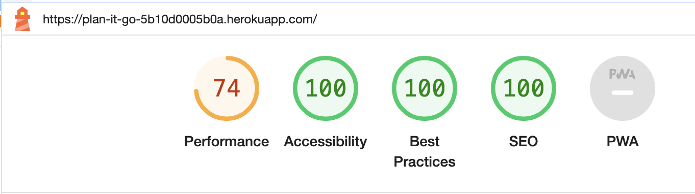

# **PlanitGo Testing**

## **Testing Overview**

## **CONTENTS**

## **Automated Testing**

### **Unit Testing**

## **Manual Testing**

### **Full Testing**

#### **Homepage**

#### **Navbar**

### **User Story Testing**

### **Form Testing**

### **Defensive Testing**

### **Javascript Testing**

## **Validators**

### **PEP8 Validation:**

<br>

I passed all python files through the [Code Institute Python Linter](https://pep8ci.herokuapp.com/) and no errors are found. Results of this tesing can be seen below:

<br>

App: planitgo

| File | Errors | Result |
| :----: | :-------: | :------: |
| asgi.py | 0 | Passed |
| settings.py | 0 | Passed |
| urls.py | 0 | Passed |
| wsgi.py | 0 | Passed |

App: home

| File | Errors | Result |
| :----: | :-------: | :------: |
| admin.py | 0 | Passed |
| apps.py | 0 | Passed |
| models.py | 0 | Passed |
| tests.py | 0 | Passed |
| urls.py | 0 | Passed |
| views.py | 0 | Passed |

App: locations

| File | Errors | Result |
| :----: | :-------: | :------: |
| admin.py | 0 | Passed |
| apps.py | 0 | Passed |
| forms.py | 0 | Passed |
| models.py | 0 | Passed |
| test_views.py | 0 | Passed |
| urls.py | 0 | Passed |
| views.py | 0 | Passed |

App: places

| File | Errors | Result |
| :----: | :-------: | :------: |
| admin.py | 0 | Passed |
| apps.py | 0 | Passed |
| forms.py | 0 | Passed |
| models.py | 0 | Passed |
| test_views.py | 0 | Passed |
| urls.py | 0 | Passed |
| views.py | 0 | Passed |

App: profiles

| File | Errors | Result |
| :----: | :-------: | :------: |
| admin.py | 0 | Passed |
| apps.py | 0 | Passed |
| forms.py | 0 | Passed |
| models.py | 0 | Passed |
| test_models.py | 0 | Passed |
| test_views.py | 0 | Passed |
| urls.py | 0 | Passed |
| views.py | 0 | Passed |

App: trips

| File | Errors | Result |
| :----: | :-------: | :------: |
| admin.py | 0 | Passed |
| apps.py | 0 | Passed |
| forms.py | 0 | Passed |
| models.py | 0 | Passed |
| test_models.py | 0 | Passed |
| test_views.py | 0 | Passed |
| urls.py | 0 | Passed |
| views.py | 0 | Passed |

Main Directory:

| File | Errors | Result |
| :----: | :-------: | :------: |
| env.py | 0 | Passed |
| manage.py | 0 | Passed |


### **W3C Markup Validator**

All pages have been run through the [W3C](https://validator.w3.org/).  Initially a couple of recurring errors appeared in various templates.  These are outlined below and have now been resolved:

• Custom attributes had been used throughout, but I had not prepended these with [**data-**](https://www.geeksforgeeks.org/what-are-custom-attributes-in-html5/).  These attributes have now been corrected.

• The following error appeared when trying to trigger the review modal by wrapping the review cards in a button: <br>
```Error: Element div not allowed as child of element button in this context. (Suppressing further errors from this subtree.)``` <br>
I solved this error by triggering the modal from a div, with a role attribute "button" and an aria label for accessibility.

It was not possible to copy and paste the html templates into the validator, due to the Django templating language being used.   Pages that can be accessed without user authentication were validated using the direct url.  However, any pages that require user login cannot be validated using the URL.  Instead, I visited each page as an authenticated user and retrieved the html code by right clicking and selecting *View Page Source*.  I then selected Validate by Direct Input on the W3C validator and pasted this raw HTML.

| Page | Errors | Warnings| Result |
| ---- | -------| --------| ------ |
| [Index.html](docs/testing/validation/html/index_html.png) | 0 | 0 | Passed |
| [place_list.html](docs/testing/validation/html/place_list_html.png) | 0 | 0 | Passed |
| [browse_detail.html](docs/testing/validation/html/browse_detail_html.png) | 0 | 0 | Passed |
| [login.html](docs/testing/validation/html/login_html.png) | 0 | 0 | Passed |
| [signup.html](docs/testing/validation/html/sign_up_html.png) | 0 | 0 | Passed |
| [trip_list.html](docs/testing/validation/html/trip_list_html.png) | 0 | 0 | Passed |
| [create_trip.html](docs/testing/validation/html/create_trip_html.png) | 0 | 1 | Passed |
| [profile_form.html](docs/testing/validation/html/profile_form_html.png) | 0 | 1 | Passed |
| [trip_detail.html](docs/testing/validation/html/trip_detail_html.png) | 0 | 0 | Passed |
| [place_detail.html](docs/testing/validation/html/place_detail_html.png) | 0 | 0 | Passed |
| [review.html](docs/testing/validation/html/review_html.png) | 0 | 0 | Passed |
| [add_image.html](docs/testing/validation/html/add_image_html.png) | 0 | 1 | Passed |
| [logout.html](docs/testing/validation/html/logout_html.png) | 0 | 0 | Passed |
| [destinations.html](docs/testing/validation/html/destinations_html.png) | 0 | 1 | Passed |
| [get_places.html](docs/testing/validation/html/get_places_html.png) | 0 | 0 | Passed |

• There was a warning that appeared on any page that contains a form with an upload image field:

```
Warning: The type: attribute is unnecessary for JavaScript resources.
```

### **W3C CSS Validator**

### **Lighthouse:**

#### Improvements

I used Lighthouse within Google Chrome developer tools as a way of testing performance, accessibility, best practices and SEO of the site.  On initial testing, there were several improvement possibilities flagged which I implemented.  On doing so, accessibility, best practices and SEO scores are now at **100** across the site.  The improvements I made are listed below:

* Some links that were only represented as font awesome icons did not have discernible names.  This was also the case for some stretched links.  I added aria labels to these to improve accessibility.
* Ensured all heading elements appear in a sequentially descending order.
* I added ```aria-hidden="true"``` to carousel button controls and followed the bootstrap documentation to make the carousel accessible.
* I was initially triggering modals using an anchor link, but ligthouse alerted me to the fact that these links were [not crawlable](https://developers.google.com/search/docs/crawling-indexing/links-crawlable?visit_id=638351626897775578-1280043289&rd=1). I resolved this by using a button elelment to trigger these modal instead.

#### Opportunities

Several opportunities were flagged by the lighthouse report to improve performance which was particularly when resting for mobile:

* ```Eliminate render-blocking resources```<br>
The main offender here was the bootstrap css file. I have attempted to improve load times by only importing bootstrap components that are being used into my scss file before compiling to css.  I have also minified the compiled css to reduce file size and results have improved

*```Properly size images / serve images in next-gen formats```<br>
The images referred to here are served by the trip advisor cdn, so I have not been able to alter the size or format of these files.  Having tested the site on various devices and networks, the issue does not seem to be impacting page load times to the detriment of the user.


<details><summary>Desktop Results</summary>

<br>

**Home Page**


**Place List**


**Browse Detail unauthenticated**


**Login**


**Signup**


**Trip List**


**Profile Form**


**Create Trip**


**Trip Detail**


**Place Detail**


**Review**


**Add Image**


**Logout**


**Destinations**


**Get Places**


</details>

<details><summary>Mobile Results</summary>

<br>

**Home Page**



**Place List**


**Browse Detail unauthenticated**


**Login**


**Signup**


**Trip List**


**Profile Form**


**Create Trip**


**Trip Detail**


**Place Detail**


**Review**


**Add Image**


**Logout**


**Destinations**


**Get Places**


</details>


### **Wave Accessibility Tests:**


